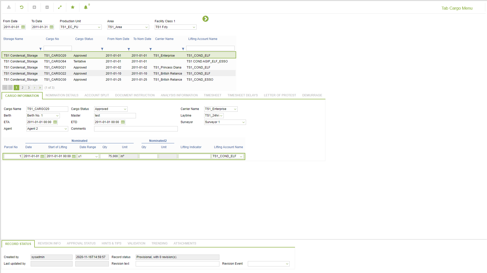
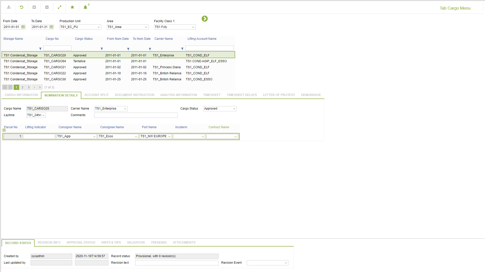
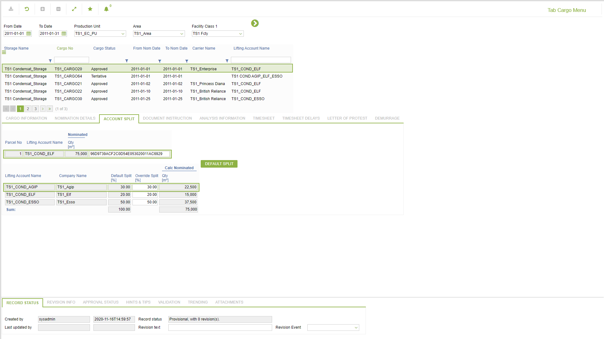
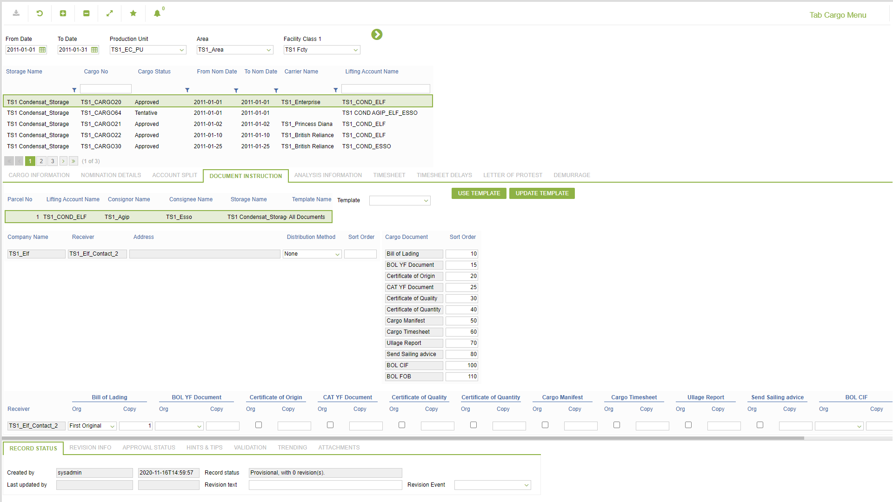
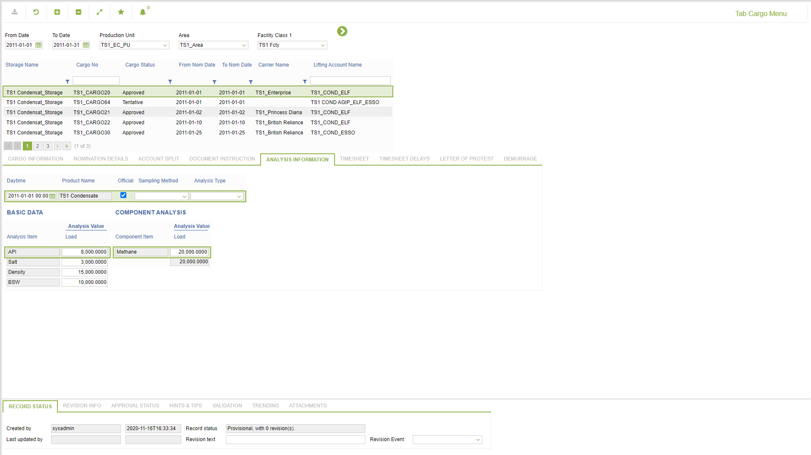
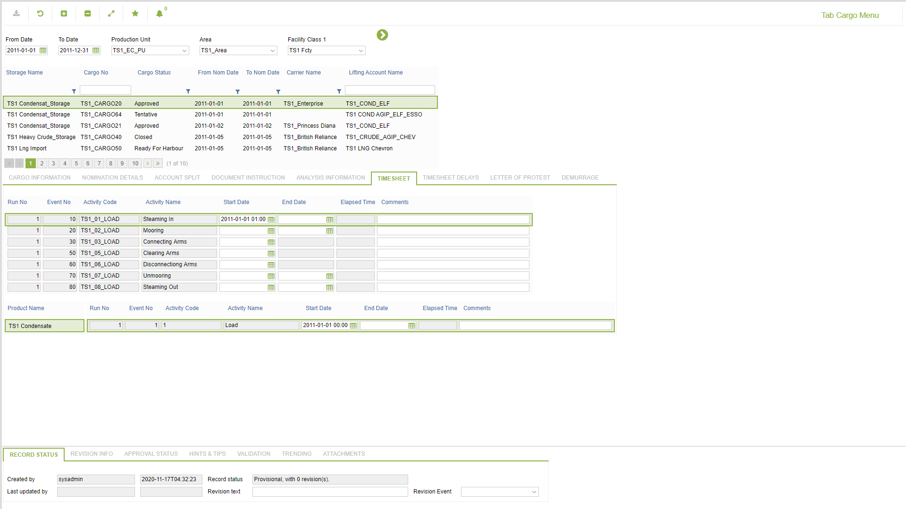
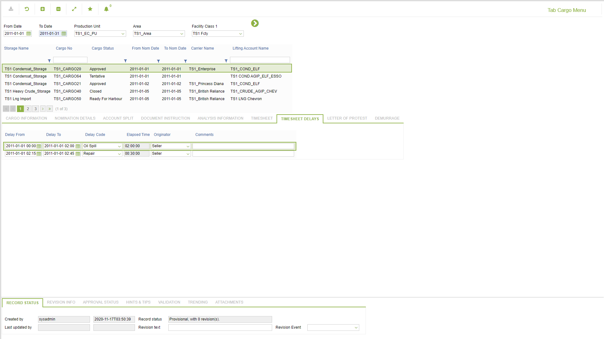
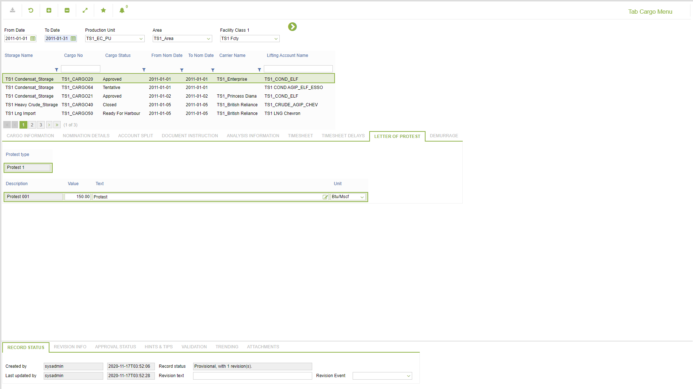
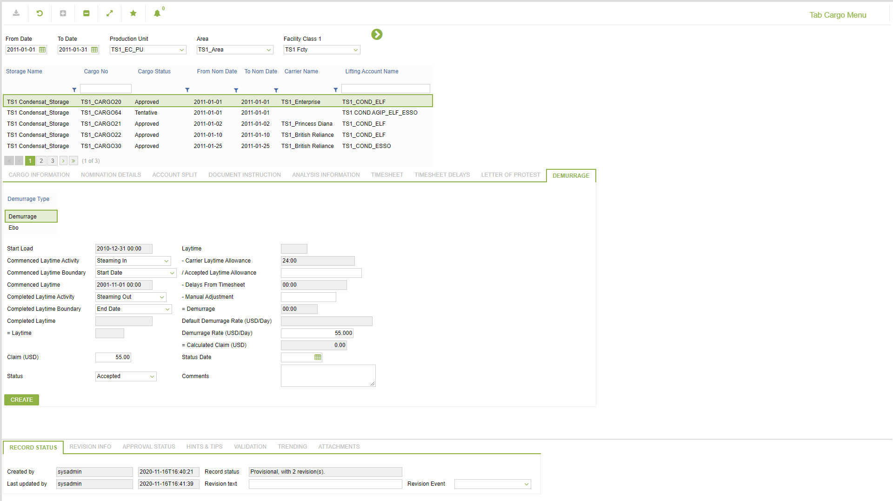

# CP.0063 - Tab Cargo Menu

_Deep-dive 2026-07-06 (deterministic runner). Module: CP._

## Identity
- BF_CODE: CP.0063 - URL: `/com.ec.tran.cp.screens/tab_cargo_menu/CARGO_NAV_CLASS/CARGO_PLANNING_NAVIGATOR/CLASS_CPY_SPLIT/STOR_LIFT_NOM_CPY_SPLIT`

## DB binding (metadata-resolved)
| Class | Type/Scope | Base table | View |
|---|---|---|---|
| `STOR_LIFT_NOM_CPY_SPLIT` | TABLE/EVENT | `STORAGE_LIFT_NOM_SPLIT` | `TV_STOR_LIFT_NOM_CPY_SPLIT` |

_Resolved by: url path token_

## Screen type
TV (table-class)

## Help (screen screenshot -- local online-help corpus 14.2.5)

## Help (field-description images -- local online-help corpus 14.2.5)
_(no field-description images in corpus for this BF_CODE)_
