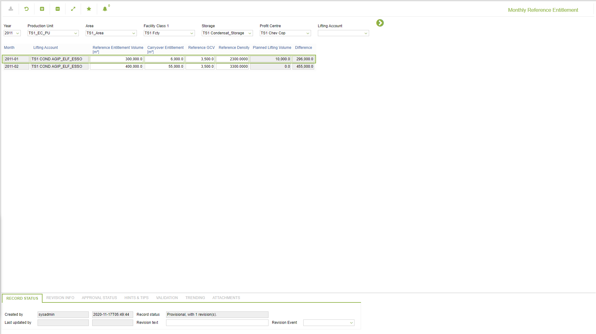

# CP.0064 - Monthly Reference Entitlement

_Deep-dive 2026-07-06 (deterministic runner). Module: CP._

## Identity
- BF_CODE: CP.0064 - URL: `/com.ec.tran.cp.screens/monthly_reference_entitlement`

## DB binding (metadata-resolved)
| Class | Type/Scope | Base table | View |
|---|---|---|---|
| `LIFT_ACC_MTH_REF_ENT` | DATA/MTH | `LIFT_ACC_MTH_REF_ENT` | `DV_LIFT_ACC_MTH_REF_ENT` |

_Resolved by: label (exact, unique)_

## Screen type
DATA/MTH

## Help (screen screenshot -- local online-help corpus 14.2.5)

## Help (field-description images -- local online-help corpus 14.2.5)
_(no field-description images in corpus for this BF_CODE)_
