# CP.0068 - Forecast Manager

_Deep-dive 2026-07-06 (deterministic runner). Module: CP._

## Identity
- BF_CODE: CP.0068 - URL: `/com.ec.tran.cp.screens/fcst_manager`

## DB binding (metadata-resolved)
| Class | Type/Scope | Base table | View |
|---|---|---|---|
| `FCST_MAN_NOM_SCHED_COMP` | DATA/EVENT | `STOR_FCST_LIFT_NOM` | `DV_FCST_MAN_NOM_SCHED_COMP` |

_Resolved by: label (exact, unique)_

## Screen type
DATA/EVENT

## Help (screen screenshot -- local online-help corpus 14.2.5)
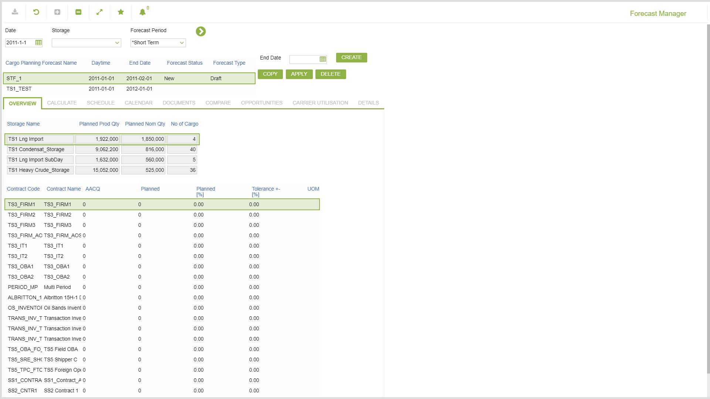
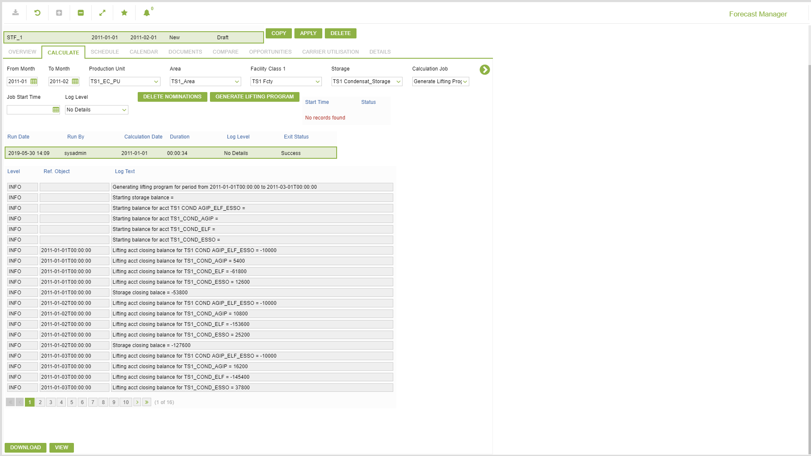
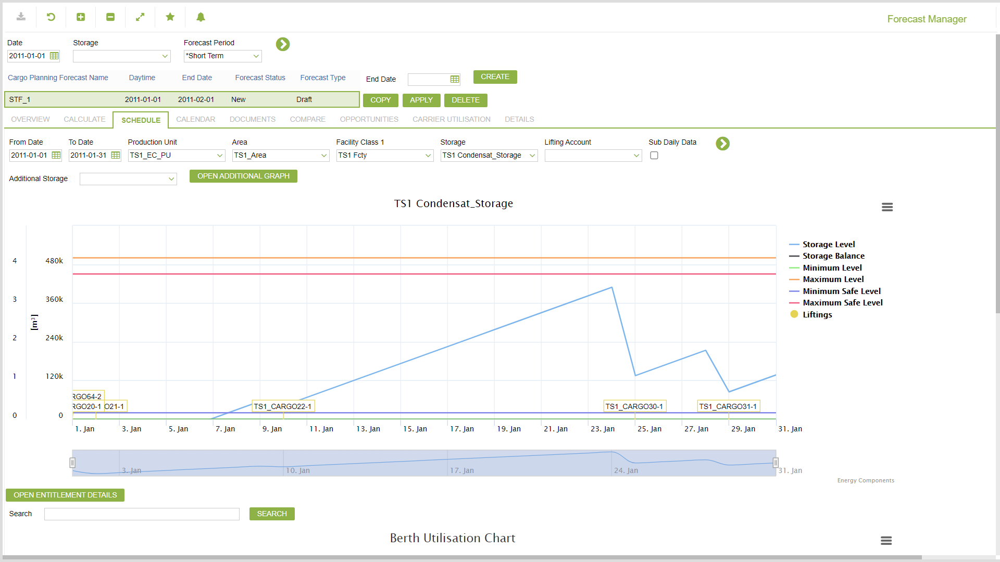
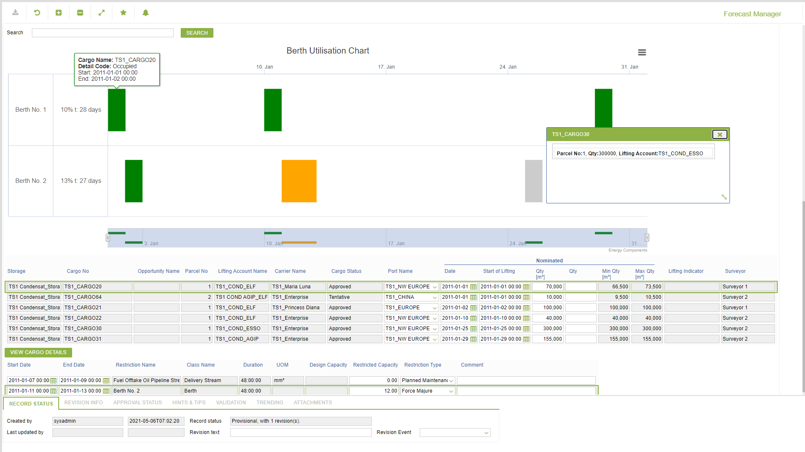
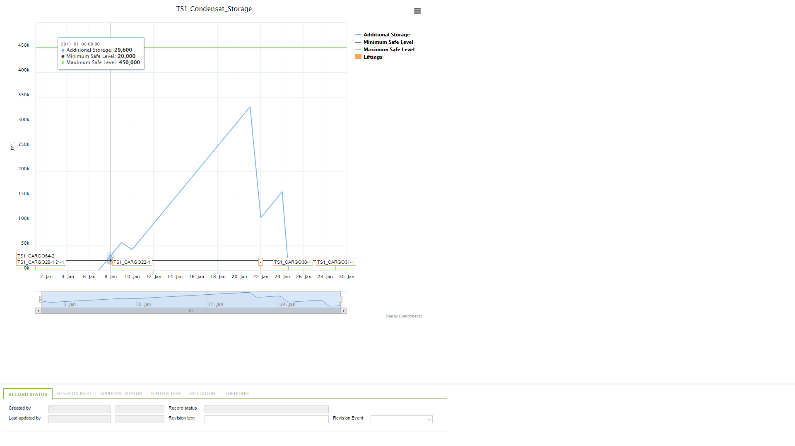
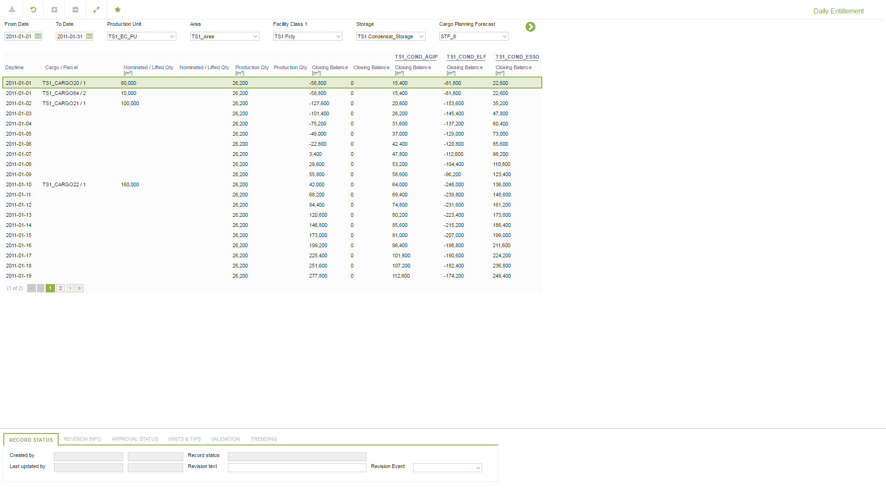
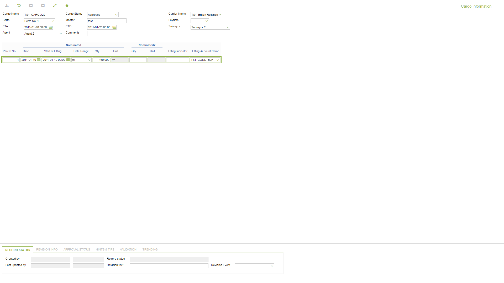
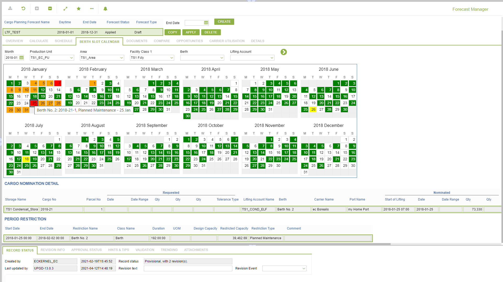
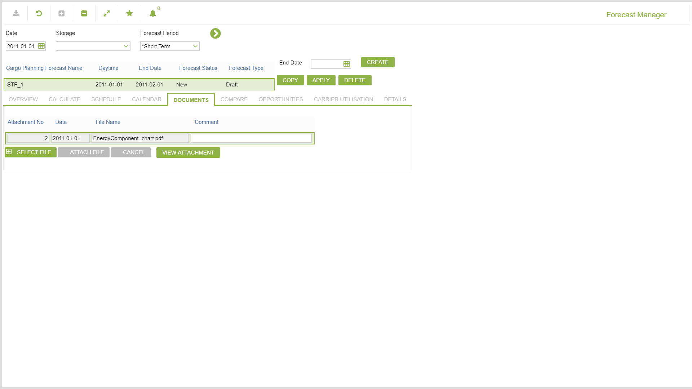
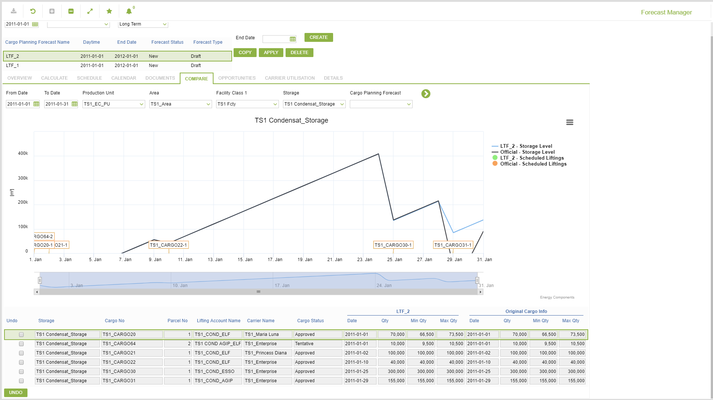
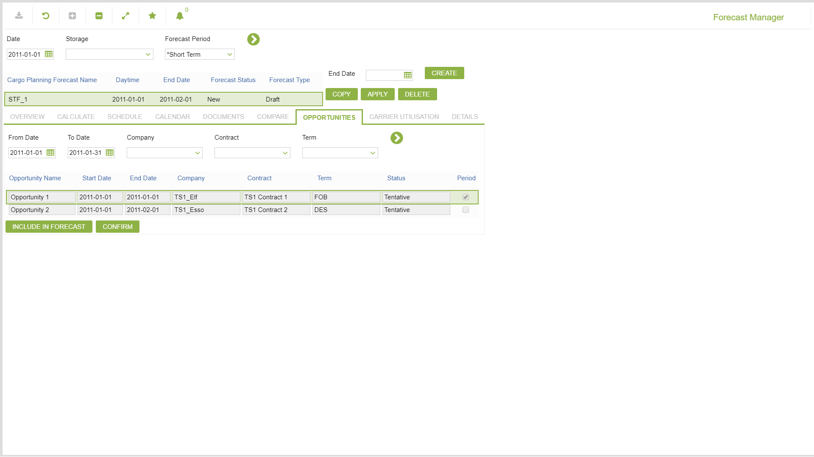
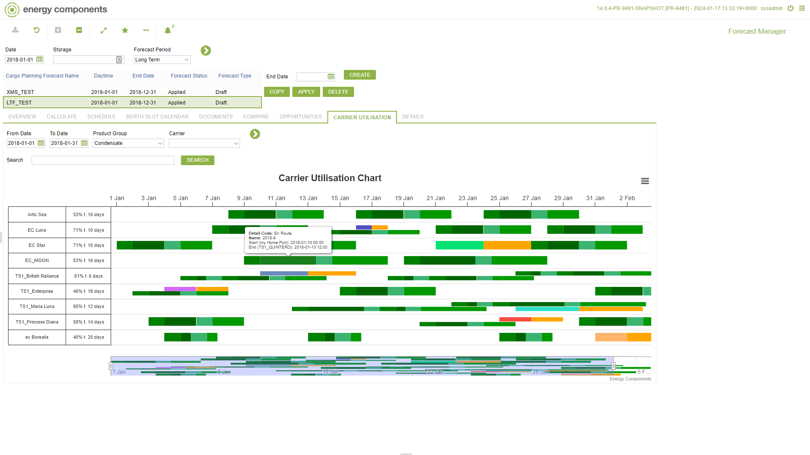
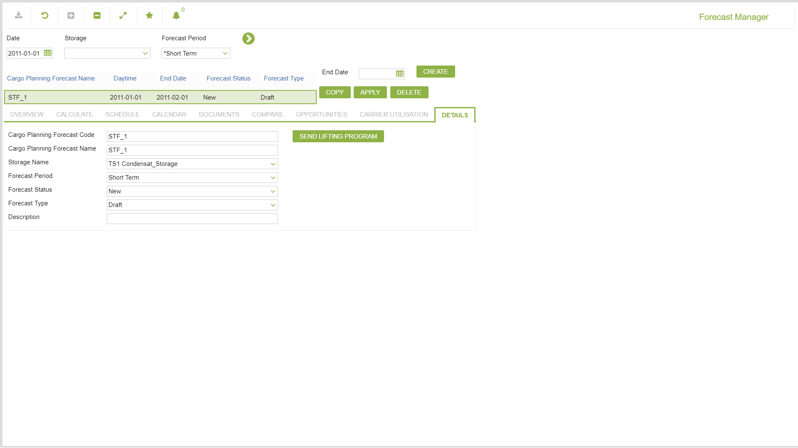

## Help (field-description images -- local online-help corpus 14.2.5)
_(no field-description images in corpus for this BF_CODE)_
