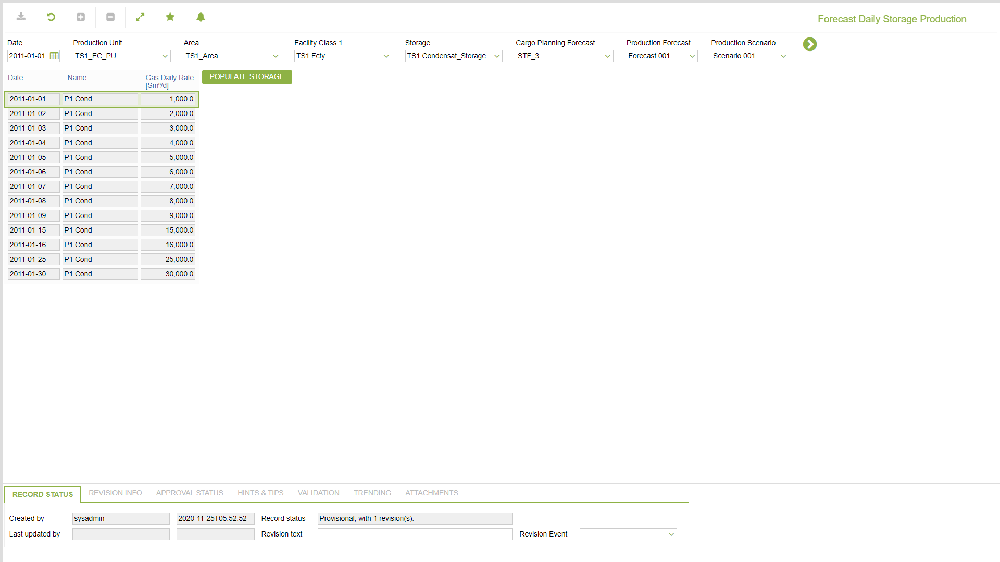

# CP.0071 - Forecast Daily Storage Production

_Deep-dive 2026-07-06 (deterministic runner). Module: CP._

## Identity
- BF_CODE: CP.0071 - URL: `/com.ec.tran.cp.screens/fcst_day_stor_prod`

## DB binding (metadata-resolved)
| Class | Type/Scope | Base table | View |
|---|---|---|---|
| `FCST_DAY_STOR_PROD` | DATA/EVENT | `FCST_STREAM_DAY` | `DV_FCST_DAY_STOR_PROD` |

_Resolved by: url path token_

## Screen type
DATA/EVENT

## Help (screen screenshot -- local online-help corpus 14.2.5)

## Help (field-description images -- local online-help corpus 14.2.5)
_(no field-description images in corpus for this BF_CODE)_
