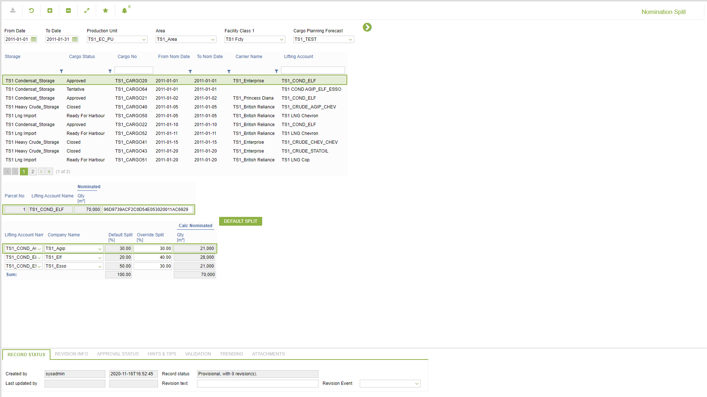

# CP.0073 - Nomination Split

_Deep-dive 2026-07-06 (deterministic runner). Module: CP._

## Identity
- BF_CODE: CP.0073 - URL: `/com.ec.tran.cp.screens/fcst_nomination_split/FCST_CARGO_NAV_CLASS/FCST_CARGO_PLAN_NAV`

## DB binding (metadata-resolved)
| Class | Type/Scope | Base table | View |
|---|---|---|---|
| `FCST_CARGO_PLAN_NAV` | TABLE/EVENT | `cargo_fcst_transport` | `TV_FCST_CARGO_PLAN_NAV` |

_Resolved by: url path token_

## Screen type
TV (table-class)

## Help (screen screenshot -- local online-help corpus 14.2.5)

## Help (field-description images -- local online-help corpus 14.2.5)
_(no field-description images in corpus for this BF_CODE)_
