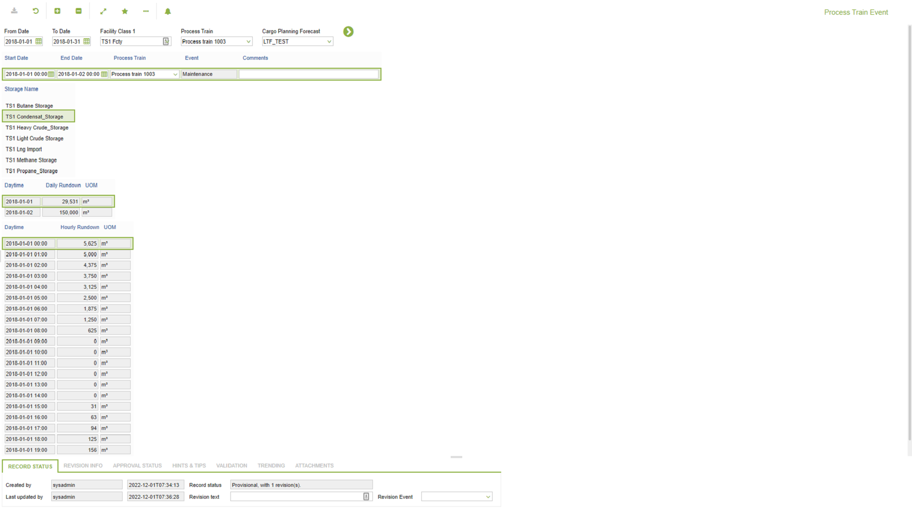

# CP.0082 - Forecast - Process Train Event

_Deep-dive 2026-07-06 (deterministic runner). Module: CP._

## Identity
- BF_CODE: CP.0082 - URL: `/com.ec.tran.cp.screens/fcst_process_train_event`

## DB binding (metadata-resolved)
| Class | Type/Scope | Base table | View |
|---|---|---|---|
| `FCST_PROCESS_TRAIN_EVENT` | DATA/DAY | `FCST_PROCESS_TRAIN_EVENT` | `DV_FCST_PROCESS_TRAIN_EVENT` |

_Resolved by: url path token_

## Screen type
N1 daily-status grid

## Help (screen screenshot -- local online-help corpus 14.2.5)

## Help (field-description images -- local online-help corpus 14.2.5)
_(no field-description images in corpus for this BF_CODE)_
