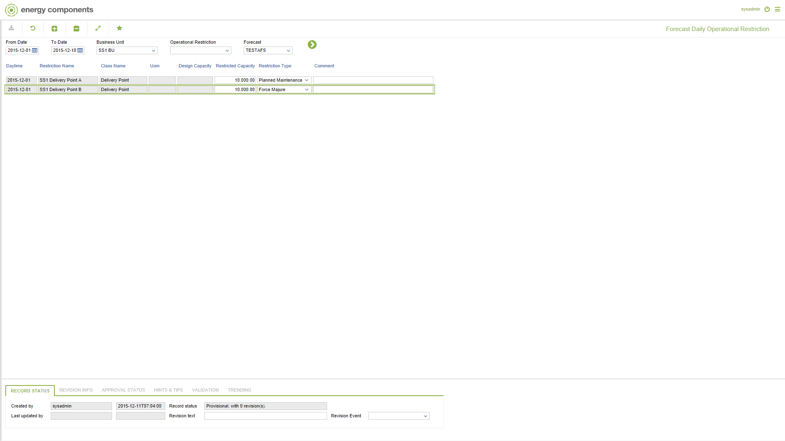

# FC.0020 - Forecast Daily Operational Restriction

_Deep-dive 2026-07-06 (deterministic runner). Module: FC._

## Identity
- BF_CODE: FC.0020 - URL: `/com.ec.tran.fc.screens/forecast_daily_operational_restriction/DATA_CLASS/FCST_OPRES_DAY_RESTRICT`

## DB binding (metadata-resolved)
| Class | Type/Scope | Base table | View |
|---|---|---|---|
| `FCST_OPRES_DAY_RESTRICT` | DATA/DAY | `FCST_OPLOC_DAY_RESTRICT` | `DV_FCST_OPRES_DAY_RESTRICT` |

_Resolved by: url path token_

## Screen type
N1 daily-status grid

## Help (screen screenshot -- local online-help corpus 14.2.5)

## Help (field-description images -- local online-help corpus 14.2.5)
_(no field-description images in corpus for this BF_CODE)_
