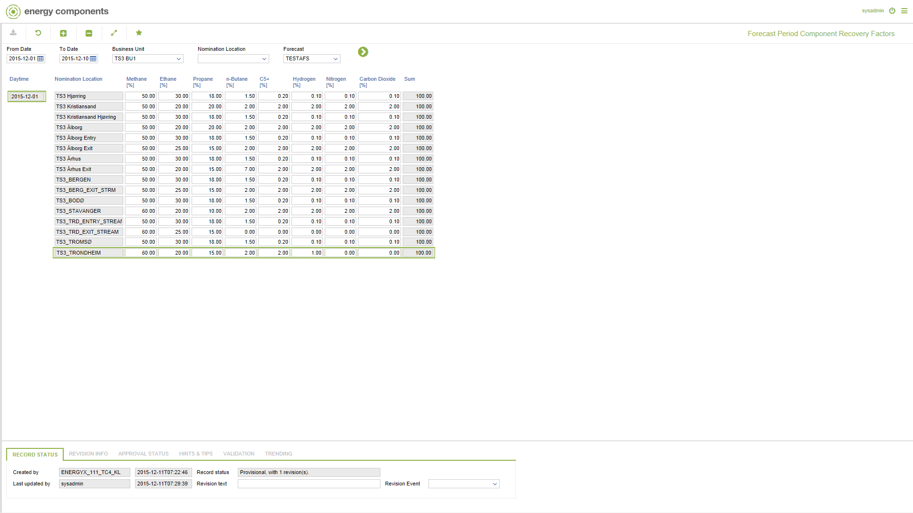

# FC.0022 - Forecast Period Component Recovery Factors

_Deep-dive 2026-07-06 (deterministic runner). Module: FC._

## Identity
- BF_CODE: FC.0022 - URL: `/com.ec.tran.fc.screens/forecast_period_component_recovery_factors/TARGET/NOMINATION_LOCATION/CLASS/FCST_RECOVERY_FACTOR/BF_PROFILE/FC.0022/CLASS_DAY/FCST_RECOVERY_FACTOR_DAY`

## DB binding (metadata-resolved)
| Class | Type/Scope | Base table | View |
|---|---|---|---|
| `FCST_RECOVERY_FACTOR_DAY` | TABLE/EVENT | `V_FCST_RECOVERY_FACTOR` | `TV_FCST_RECOVERY_FACTOR_DAY` |

_Resolved by: url path token_

## Screen type
TV (table-class)

## Help (screen screenshot -- local online-help corpus 14.2.5)

## Help (field-description images -- local online-help corpus 14.2.5)
_(no field-description images in corpus for this BF_CODE)_
