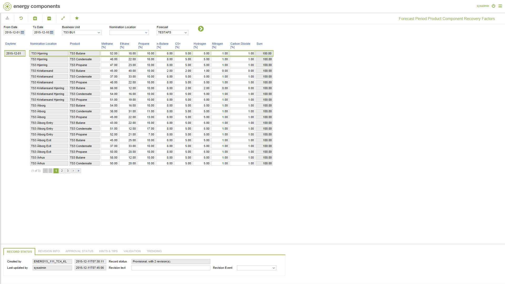

# FC.0023 - Forecast Period Product Component Recovery Factors

_Deep-dive 2026-07-06 (deterministic runner). Module: FC._

## Identity
- BF_CODE: FC.0023 - URL: `/com.ec.tran.fc.screens/forecast_period_product_component_recovery_factors/TARGET/NOMINATION_LOCATION/CLASS/FCST_TRNL_PRD_CP_REC_FAC/BF_PROFILE/FC.0023/CLASS_DAY/FCST_TRNL_PRD_CP_REC_DAY/DIM1/PRODUCT_ID_POPUP/FCST_CLASS/FORECAST_TRAN_FC`

## DB binding (metadata-resolved)
| Class | Type/Scope | Base table | View |
|---|---|---|---|
| `FORECAST_TRAN_FC` | OBJECT/VERSIONED | `FORECAST` | `OV_FORECAST_TRAN_FC` |

_Resolved by: url path token_

## Screen type
OV (master-data object)

## Help (screen screenshot -- local online-help corpus 14.2.5)

## Help (field-description images -- local online-help corpus 14.2.5)
_(no field-description images in corpus for this BF_CODE)_
