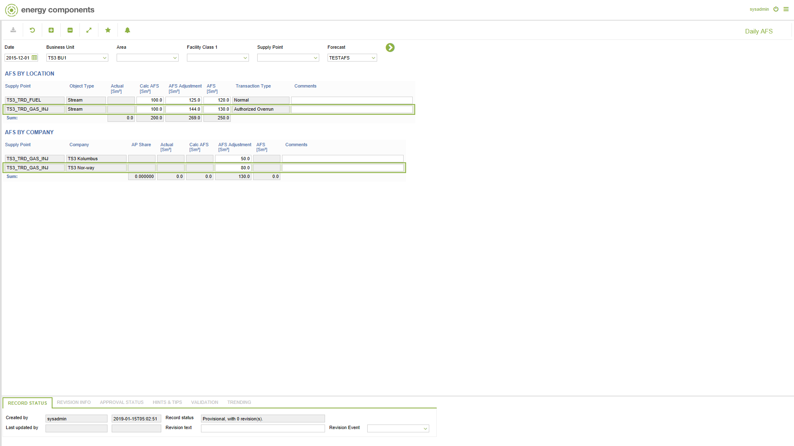

# FC.0025 - Daily AFS

_Deep-dive 2026-07-06 (deterministic runner). Module: FC._

## Identity
- BF_CODE: FC.0025 - URL: `/com.ec.tran.fc.screens/daily_afs/TARGET/SUPPLY_POINT/CLASS1/FCST_SP_DAY_AFS/CLASS2/FCST_SP_DAY_CPY_AFS`

## DB binding (metadata-resolved)
| Class | Type/Scope | Base table | View |
|---|---|---|---|
| `FCST_SP_DAY_CPY_AFS` | DATA/DAY | `FCST_SP_DAY_CPY_AFS` | `DV_FCST_SP_DAY_CPY_AFS` |

_Resolved by: url path token_

## Screen type
N1 daily-status grid

## Help (screen screenshot -- local online-help corpus 14.2.5)

## Help (field-description images -- local online-help corpus 14.2.5)
_(no field-description images in corpus for this BF_CODE)_
