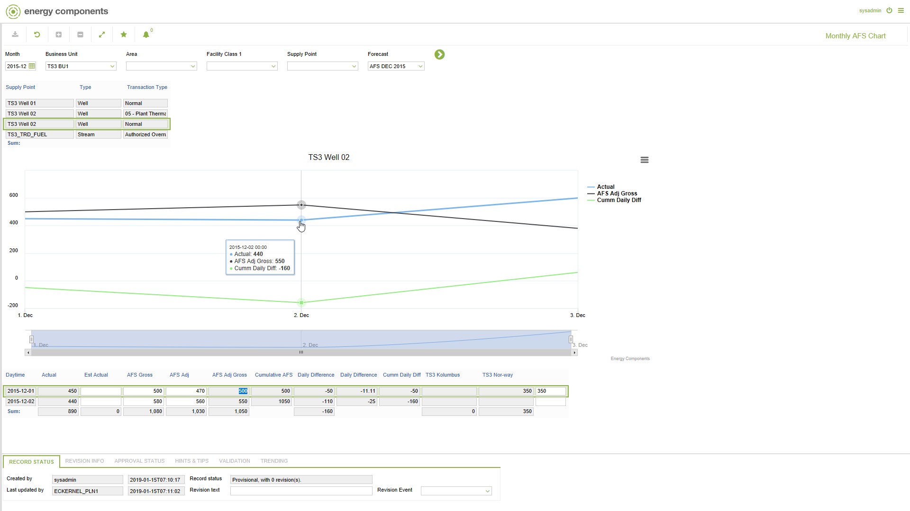

# FC.0027 - Monthly AFS Chart

_Deep-dive 2026-07-06 (deterministic runner). Module: FC._

## Identity
- BF_CODE: FC.0027 - URL: `/com.ec.tran.fc.screens/monthly_afs_chart/TARGET/SUPPLY_POINT/CLASS1/FCST_SP_DAY_AFS_LIST/CLASS2/FCST_SP_DAY_AFS_GRAPH/CLASS3/FCST_SP_DAY_AFS_OVERVIEW`

## DB binding (metadata-resolved)
| Class | Type/Scope | Base table | View |
|---|---|---|---|
| `FCST_SP_DAY_AFS_OVERVIEW` | DATA/DAY | `V_FCST_SP_DAY_AFS_OVERVIEW` | `DV_FCST_SP_DAY_AFS_OVERVIEW` |

_Resolved by: url path token_

## Screen type
N1 daily-status grid

## Help (screen screenshot -- local online-help corpus 14.2.5)

## Help (field-description images -- local online-help corpus 14.2.5)
_(no field-description images in corpus for this BF_CODE)_
