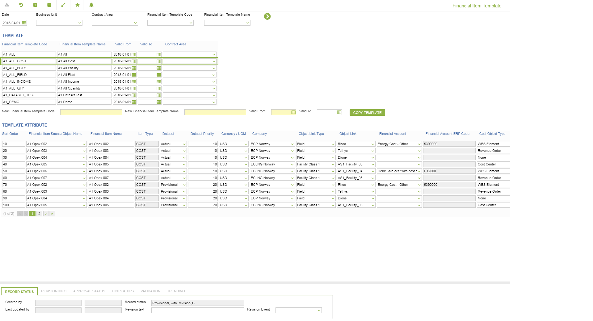

# FI.0002 - Financial Item Template

_Deep-dive 2026-07-07 (deterministic runner). Module: FI._

## Identity
- BF_CODE: FI.0002 - URL: `/com.ec.revn.fi/financial_item_template`

## DB binding (metadata-resolved)
| Class | Type/Scope | Base table | View |
|---|---|---|---|
| `FINANCIAL_ITEM_TEMPLATE` | TABLE/EVENT | `FINANCIAL_ITEM_TEMPLATE` | `TV_FINANCIAL_ITEM_TEMPLATE` |

_Resolved by: url path token_

## Screen type
TV (table-class)

## Help (screen screenshot -- local online-help corpus 14.2.5)

## Help (field-description images -- local online-help corpus 14.2.5)
_(no field-description images in corpus for this BF_CODE)_
