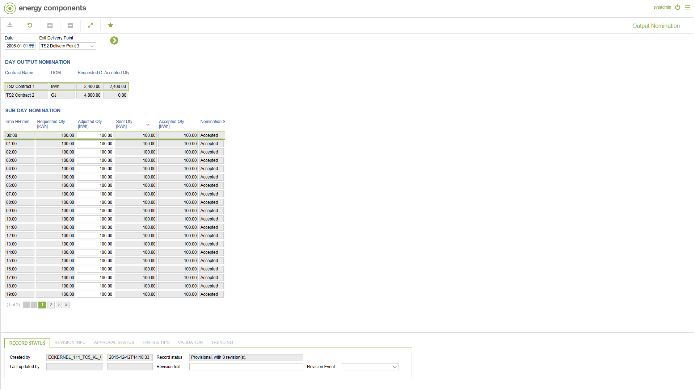

# GD.0001 - Output Nomination

_Deep-dive 2026-07-05 (deterministic runner). Module: GD._

## Identity
- BF_CODE: GD.0001 - URL: `/com.ec.tran.gd.screens/output_nomination`

## DB binding (metadata-resolved)
| Class | Type/Scope | Base table | View |
|---|---|---|---|
| `TCTR_DAY_DP_OUT_NOM` | DATA/DAY | `CNTR_DAY_DP_NOM` | `DV_TCTR_DAY_DP_OUT_NOM` |

_Resolved by: label (exact, unique)_

## Screen type
N1 daily-status grid

## Help (screen screenshot -- local online-help corpus 14.2.5)

## Help (field-description images -- local online-help corpus 14.2.5)
_(no field-description images in corpus for this BF_CODE)_
