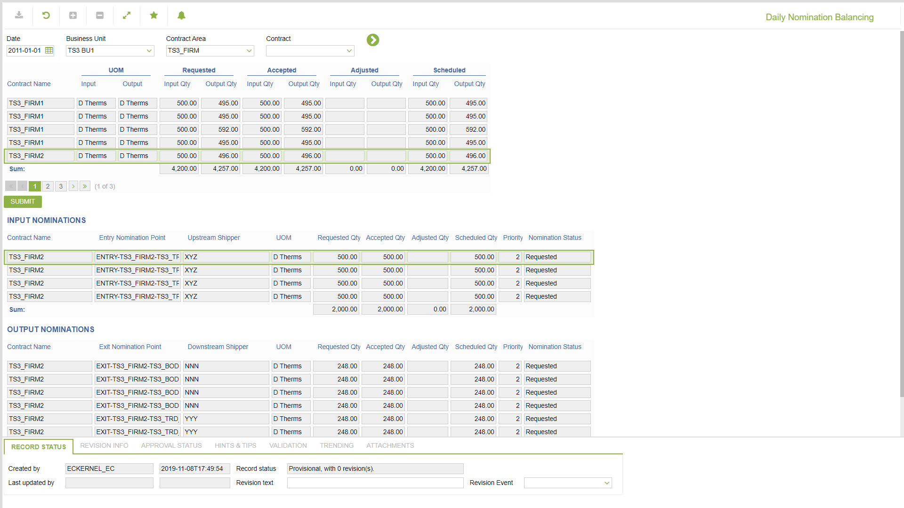

# GD.0028.1 - Daily Nomination Balancing

_Deep-dive 2026-07-05 (deterministic runner). Module: GD._

## Identity
- BF_CODE: GD.0028.1 - URL: `/com.ec.tran.gd.screens/daily_nomination_balancing/CLASS/TRCN_DAY_NOM_BAL/NOMINATION_CYCLE/true`

## DB binding (metadata-resolved)
| Class | Type/Scope | Base table | View |
|---|---|---|---|
| (no class resolved from URL/LABEL) | | | |

_Resolved by: ambiguous label (4 candidates) - left unresolved_

## Screen type
process/config (no data class -- e.g. a process trigger, rule/formula editor or combination screen)

## Help (screen screenshot -- local online-help corpus 14.2.5)

## Help (field-description images -- local online-help corpus 14.2.5)
_(no field-description images in corpus for this BF_CODE)_
