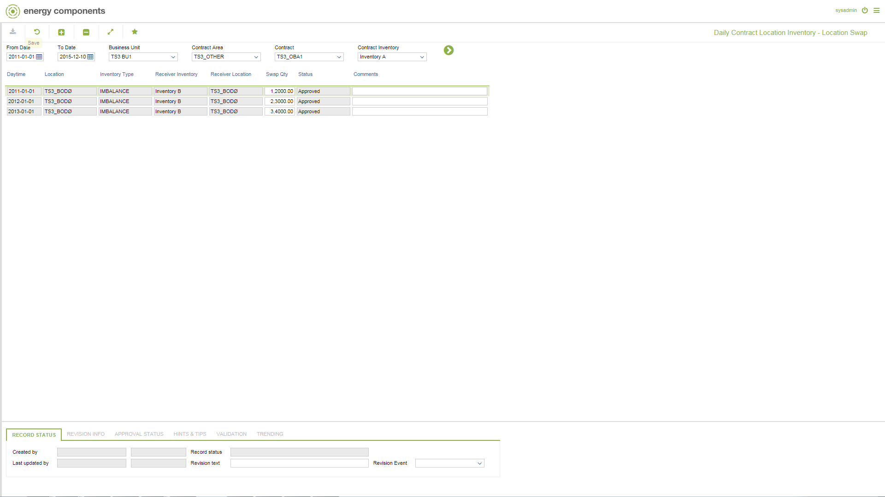

# GD.0033.LS - Daily Contract Location Inventory - Location Swap

_Deep-dive 2026-07-05 (deterministic runner). Module: GD._

## Identity
- BF_CODE: GD.0033.LS - URL: `/com.ec.tran.gd.screens/daily_contract_loc_swap/CLASS_NAME/CNTR_DAY_INV_LOC_SWAP/BF_PROFILE/GD.0033.LS`

## DB binding (metadata-resolved)
| Class | Type/Scope | Base table | View |
|---|---|---|---|
| `CNTR_DAY_INV_LOC_SWAP` | DATA/EVENT | `CNTR_DAY_INV_SWAP` | `DV_CNTR_DAY_INV_LOC_SWAP` |

_Resolved by: url CLASS_NAME_

## Screen type
DATA/EVENT

## Help (screen screenshot -- local online-help corpus 14.2.5)

## Help (field-description images -- local online-help corpus 14.2.5)
_(no field-description images in corpus for this BF_CODE)_
