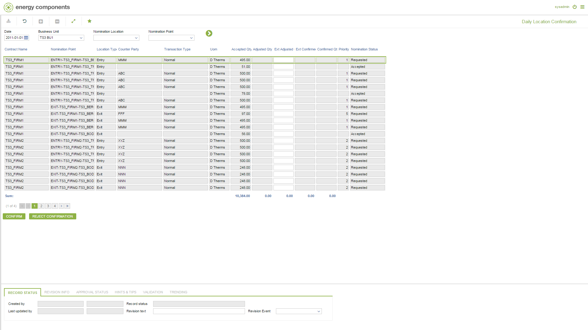

# GD.0034 - Daily Location Confirmation

_Deep-dive 2026-07-05 (deterministic runner). Module: GD._

## Identity
- BF_CODE: GD.0034 - URL: `/com.ec.tran.gd.screens/daily_location_confirmation/CLASS/TRNP_DAY_NOM_CONF/TARGET/NOMINATION_POINT/NOMINATION_CYCLE/false`

## DB binding (metadata-resolved)
| Class | Type/Scope | Base table | View |
|---|---|---|---|
| `TRNP_DAY_NOM_CONF` | DATA/DAY | `NOMPNT_DAY_NOMINATION` | `DV_TRNP_DAY_NOM_CONF` |

_Resolved by: label (exact, unique)_

## Screen type
N1 daily-status grid

## Help (screen screenshot -- local online-help corpus 14.2.5)

## Help (field-description images -- local online-help corpus 14.2.5)
_(no field-description images in corpus for this BF_CODE)_
