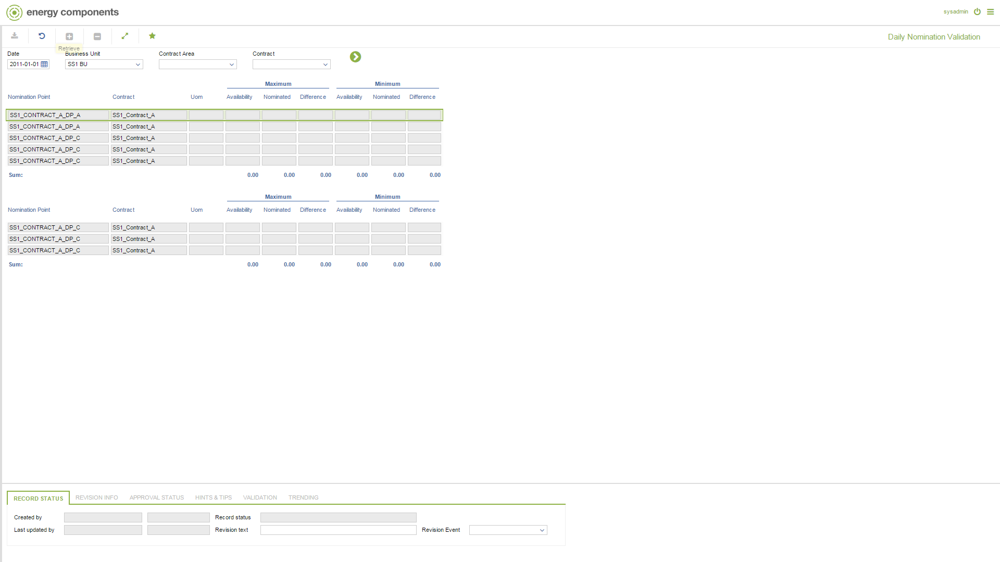

# GD.0043 - Daily Nomination Validation

_Deep-dive 2026-07-05 (deterministic runner). Module: GD._

## Identity
- BF_CODE: GD.0043 - URL: `/com.ec.tran.gd.screens/daily_nomination_validation/DATA_CLASS_1/TRNP_DAY_NOM_VAL/DATA_CLASS_2/TRNP_DAY_NOM_VAL_CONN`

## DB binding (metadata-resolved)
| Class | Type/Scope | Base table | View |
|---|---|---|---|
| `TRNP_DAY_NOM_VAL_CONN` | DATA/EVENT | `NOMPNT_DAY_NOMINATION` | `DV_TRNP_DAY_NOM_VAL_CONN` |

_Resolved by: url path token_

## Screen type
DATA/EVENT

## Help (screen screenshot -- local online-help corpus 14.2.5)

## Help (field-description images -- local online-help corpus 14.2.5)
_(no field-description images in corpus for this BF_CODE)_
