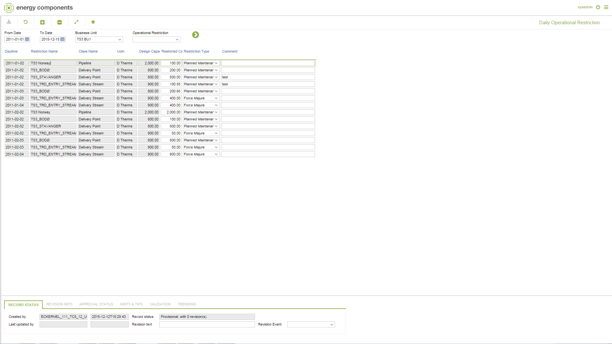

# GD.0050 - Daily Operational Restriction

_Deep-dive 2026-07-05 (deterministic runner). Module: GD._

## Identity
- BF_CODE: GD.0050 - URL: `/com.ec.tran.gd.screens/daily_operational_restriction/CLASS/OPRES_DAY_RESTRICTION`

## DB binding (metadata-resolved)
| Class | Type/Scope | Base table | View |
|---|---|---|---|
| `OPRES_DAY_RESTRICTION` | DATA/DAY | `OPLOC_DAILY_RESTRICTION` | `DV_OPRES_DAY_RESTRICTION` |

_Resolved by: url path token_

## Screen type
N1 daily-status grid

## Help (screen screenshot -- local online-help corpus 14.2.5)

## Help (field-description images -- local online-help corpus 14.2.5)
_(no field-description images in corpus for this BF_CODE)_
