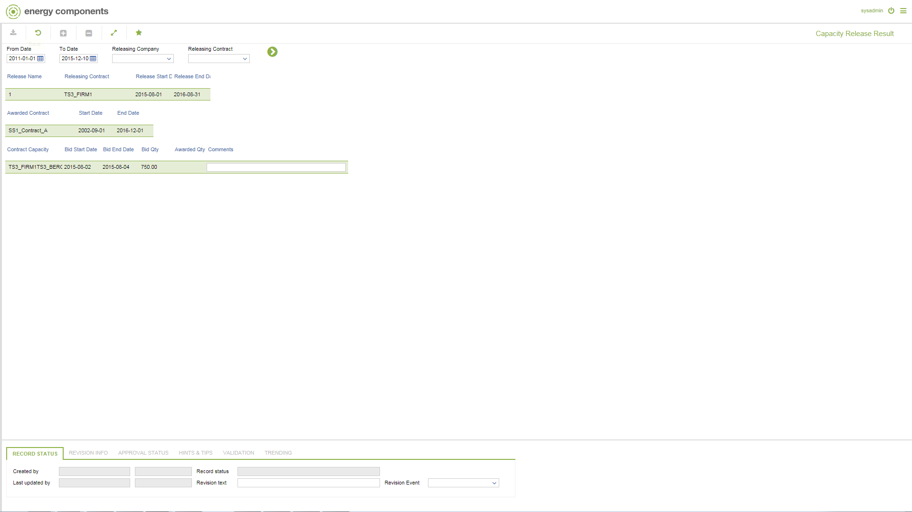

# GD.0059 - Capacity Release Result

_Deep-dive 2026-07-05 (deterministic runner). Module: GD._

## Identity
- BF_CODE: GD.0059 - URL: `/com.ec.tran.gd.screens/capacity_release_result/CLASS/CAP_REL_RESULT_LOCATION`

## DB binding (metadata-resolved)
| Class | Type/Scope | Base table | View |
|---|---|---|---|
| `CAP_REL_RESULT_LOCATION` | TABLE/EVENT | `CAPACITY_BID_LOCATION` | `TV_CAP_REL_RESULT_LOCATION` |

_Resolved by: url path token_

## Screen type
TV (table-class)

## Help (screen screenshot -- local online-help corpus 14.2.5)

## Help (field-description images -- local online-help corpus 14.2.5)
_(no field-description images in corpus for this BF_CODE)_
