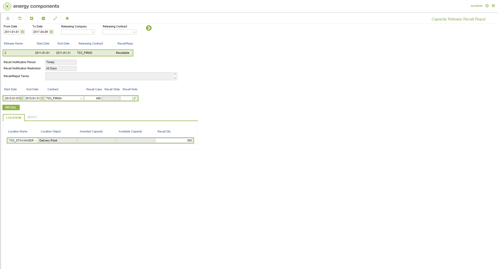
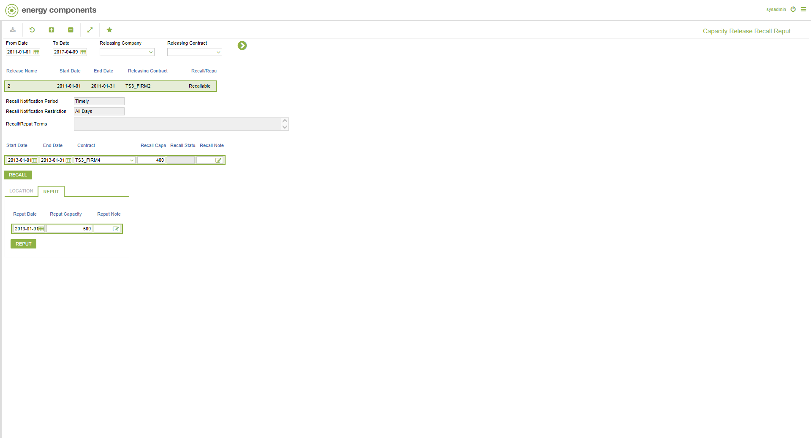

# GD.0060 - Capacity Release Recall Reput

_Deep-dive 2026-07-05 (deterministic runner). Module: GD._

## Identity
- BF_CODE: GD.0060 - URL: `/com.ec.tran.gd.screens/capacity_release_recall_reput`

## DB binding (metadata-resolved)
| Class | Type/Scope | Base table | View |
|---|---|---|---|
| `CAPACITY_REL_REPUT` | TABLE/EVENT | `CAPACITY_REL_REPUT` | `TV_CAPACITY_REL_REPUT` |

_Resolved by: label (exact, unique)_

## Screen type
TV (table-class)

## Help (screen screenshot -- local online-help corpus 14.2.5)

## Help (field-description images -- local online-help corpus 14.2.5)
_(no field-description images in corpus for this BF_CODE)_
