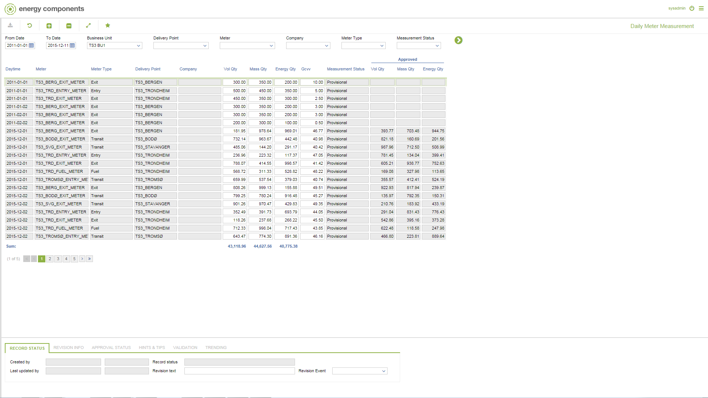

# GD.0070 - Daily Meter Measurement

_Deep-dive 2026-07-05 (deterministic runner). Module: GD._

## Identity
- BF_CODE: GD.0070 - URL: `/com.ec.tran.gd.screens/daily_meter_measurement/CLASS/METER_DAY_MEASUREMENT`

## DB binding (metadata-resolved)
| Class | Type/Scope | Base table | View |
|---|---|---|---|
| `METER_DAY_MEASUREMENT` | DATA/DAY | `METER_MEASUREMENT` | `DV_METER_DAY_MEASUREMENT` |

_Resolved by: url path token_

## Screen type
N1 daily-status grid

## Help (screen screenshot -- local online-help corpus 14.2.5)

## Help (field-description images -- local online-help corpus 14.2.5)
_(no field-description images in corpus for this BF_CODE)_
