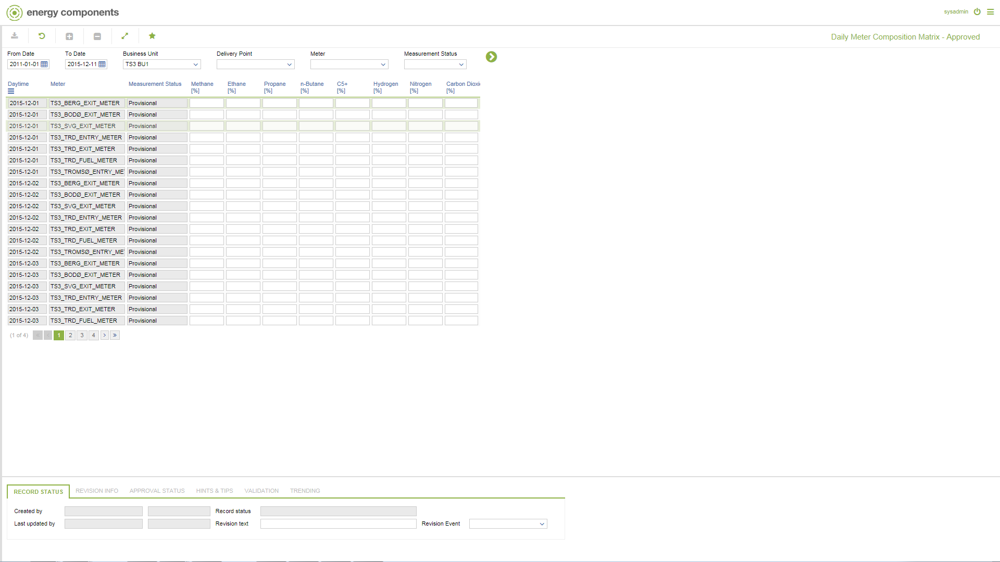

# GD.0075.01 - Daily Meter Composition Matrix - Approved

_Deep-dive 2026-07-05 (deterministic runner). Module: GD._

## Identity
- BF_CODE: GD.0075.01 - URL: `/com.ec.tran.gd.screens/daily_meter_composition_matrix/CLASS/METER_DAY_COMP_APPROVED`

## DB binding (metadata-resolved)
| Class | Type/Scope | Base table | View |
|---|---|---|---|
| `METER_DAY_COMP_APPROVED` | DATA/EVENT | `V_METER_COMPOSITION` | `DV_METER_DAY_COMP_APPROVED` |

_Resolved by: url path token_

## Screen type
DATA/EVENT

## Help (screen screenshot -- local online-help corpus 14.2.5)

## Help (field-description images -- local online-help corpus 14.2.5)
_(no field-description images in corpus for this BF_CODE)_
