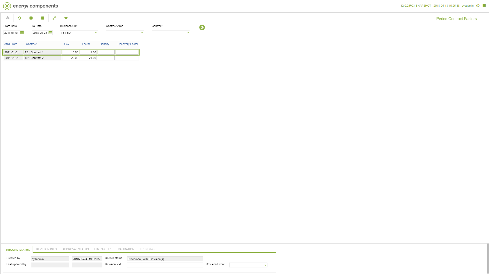

# GD.0077.01 - Period Contract Factors

_Deep-dive 2026-07-05 (deterministic runner). Module: GD._

## Identity
- BF_CODE: GD.0077.01 - URL: `/com.ec.tran.gd.screens/period_factors/TARGET/CONTRACT/BF_PROFILE/GD.0077.01/CLASS/TRCN_FACTOR`

## DB binding (metadata-resolved)
| Class | Type/Scope | Base table | View |
|---|---|---|---|
| `TRCN_FACTOR` | DATA/EVENT | `OBJ_TRAN_EVENT_FACTOR` | `DV_TRCN_FACTOR` |

_Resolved by: url path token_

## Screen type
DATA/EVENT

## Help (screen screenshot -- local online-help corpus 14.2.5)

## Help (field-description images -- local online-help corpus 14.2.5)
_(no field-description images in corpus for this BF_CODE)_
