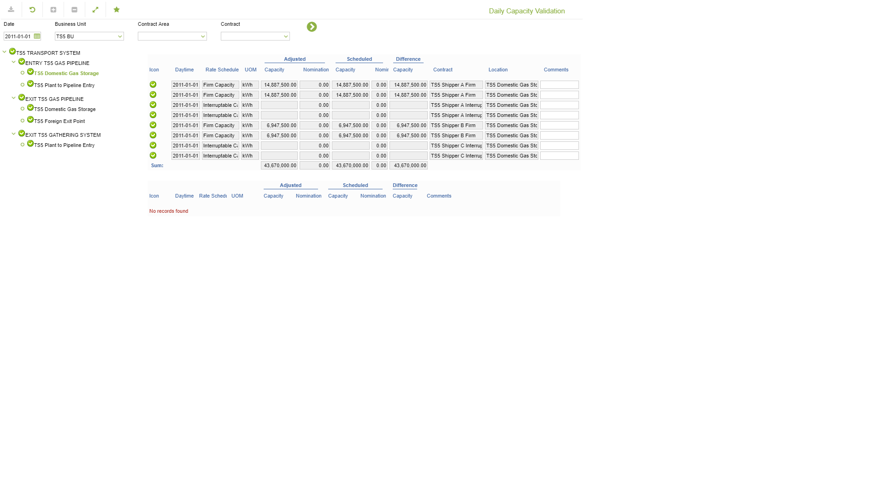

# GD.0082 - Daily Capacity Validation

_Deep-dive 2026-07-05 (deterministic runner). Module: GD._

## Identity
- BF_CODE: GD.0082 - URL: `/com.ec.tran.gd.screens/capacity_validation/DATA1_CLASS/TRCN_DAY_CAP_VALID/DATA2_CLASS/TRCN_SUB_DAY_CAP_VALID/NAV_MODEL/TRAN_COMMERCIAL/TARGET/CONTRACT`

## DB binding (metadata-resolved)
| Class | Type/Scope | Base table | View |
|---|---|---|---|
| `CONTRACT` | OBJECT/VERSIONED | `CONTRACT` | `OV_CONTRACT` |

_Resolved by: url path token_

## Screen type
OV (master-data object)

## Help (screen screenshot -- local online-help corpus 14.2.5)

## Help (field-description images -- local online-help corpus 14.2.5)
_(no field-description images in corpus for this BF_CODE)_
