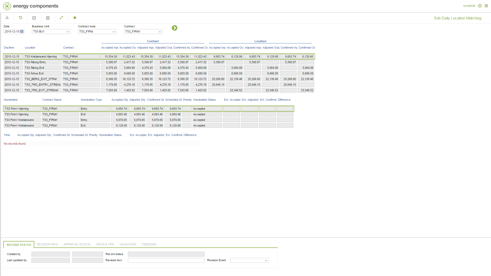

# GD.0083 - Sub Daily Location Matching

_Deep-dive 2026-07-05 (deterministic runner). Module: GD._

## Identity
- BF_CODE: GD.0083 - URL: `/com.ec.tran.gd.screens/sub_daily_location_matching/NAV_MODEL/TRAN_COMMERCIAL/TARGET/CONTRACT/CLASS/TRNL_DAY_NOM_MATCH2/DAY_CLASS/TRNP_DAY_LOC_MATCHING/SUB_DAY/TRNP_SUB_DAY_LOC_MATCH`

## DB binding (metadata-resolved)
| Class | Type/Scope | Base table | View |
|---|---|---|---|
| `TRNP_SUB_DAY_LOC_MATCH` | DATA/1HR | `NOMPNT_SUB_DAY_NOMINATION` | `DV_TRNP_SUB_DAY_LOC_MATCH` |

_Resolved by: url path token_

## Screen type
DATA/1HR

## Help (screen screenshot -- local online-help corpus 14.2.5)

## Help (field-description images -- local online-help corpus 14.2.5)
_(no field-description images in corpus for this BF_CODE)_
