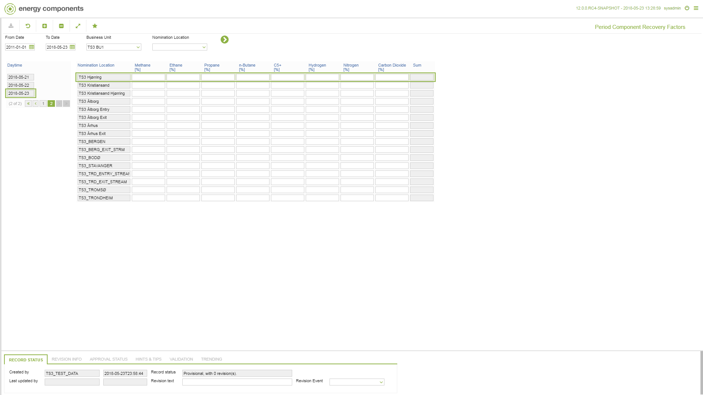

# GD.0085 - Period Component Recovery Factors

_Deep-dive 2026-07-05 (deterministic runner). Module: GD._

## Identity
- BF_CODE: GD.0085 - URL: `/com.ec.tran.gd.screens/component_recovery_factors/TARGET/NOMINATION_LOCATION/CLASS/TRNP_EVENT_CP_TRAN_FAC/BF_PROFILE/GD.0085/CLASS_DAY/TRNL_EVENT_TRAN_FAC_DAY`

## DB binding (metadata-resolved)
| Class | Type/Scope | Base table | View |
|---|---|---|---|
| `TRNL_EVENT_TRAN_FAC_DAY` | TABLE/EVENT | `V_OBJ_EVENT_CP_TRAN_FACTOR` | `TV_TRNL_EVENT_TRAN_FAC_DAY` |

_Resolved by: url path token_

## Screen type
TV (table-class)

## Help (screen screenshot -- local online-help corpus 14.2.5)

## Help (field-description images -- local online-help corpus 14.2.5)
_(no field-description images in corpus for this BF_CODE)_
