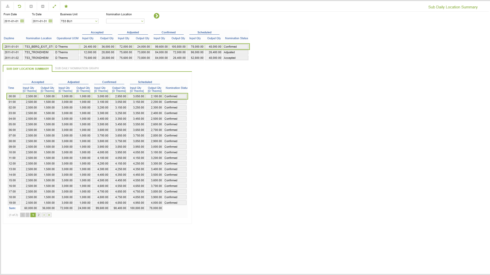
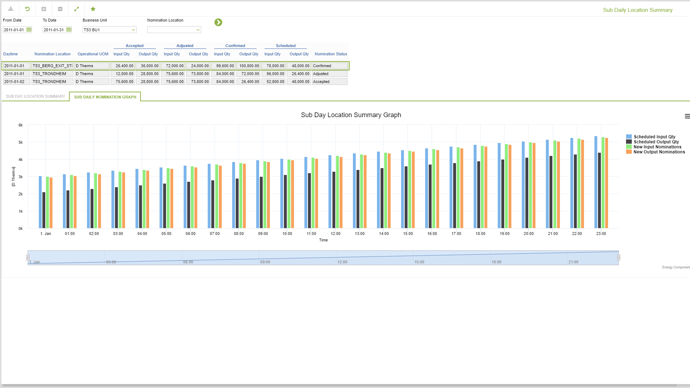

# GD.0091 - Sub Daily Location Summary

_Deep-dive 2026-07-05 (deterministic runner). Module: GD._

## Identity
- BF_CODE: GD.0091 - URL: `/com.ec.tran.gd.screens/sub_daily_location_summary/TARGET/NOMINATION_LOCATION/CLASS/TRNL_DAY_NOM_AGG/SUB_CLASS/TRNL_SUB_DAY_NOM_AGG/GRAPH_CLASS/TRNL_SUB_DAY_NOM_AGG_GRA/NAV_MODEL/TRAN_OPERATIONAL/BF_PROFILE/GD.0091/NOMINATION_CYCLE/false`

## DB binding (metadata-resolved)
| Class | Type/Scope | Base table | View |
|---|---|---|---|
| (no class resolved from URL/LABEL) | | | |

_Resolved by: not resolved_

## Screen type
process/config (no data class -- e.g. a process trigger, rule/formula editor or combination screen)

## Help (screen screenshot -- local online-help corpus 14.2.5)

## Help (field-description images -- local online-help corpus 14.2.5)
_(no field-description images in corpus for this BF_CODE)_
