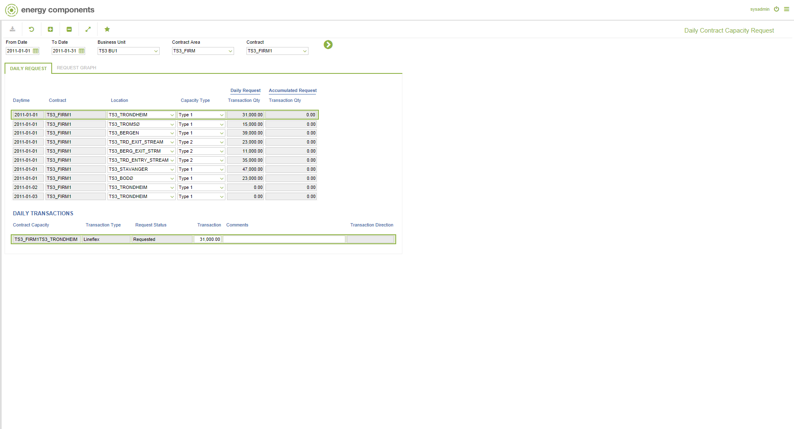
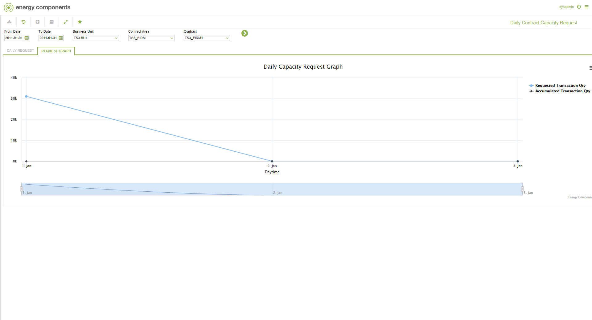

# GD.0092 - Daily Contract Capacity Request

_Deep-dive 2026-07-05 (deterministic runner). Module: GD._

## Identity
- BF_CODE: GD.0092 - URL: `/com.ec.tran.gd.screens/daily_contract_capacity_request/CLASS_1/CNTR_DAY_CAPACITY_REQ/CLASS_2/CNTR_CAPACITY_DAY_TRANS`

## DB binding (metadata-resolved)
| Class | Type/Scope | Base table | View |
|---|---|---|---|
| `CNTR_CAPACITY_DAY_TRANS` | DATA/EVENT | `CNTR_CAPACITY_DAY_TRANS` | `DV_CNTR_CAPACITY_DAY_TRANS` |

_Resolved by: url path token_

## Screen type
DATA/EVENT

## Help (screen screenshot -- local online-help corpus 14.2.5)

## Help (field-description images -- local online-help corpus 14.2.5)
_(no field-description images in corpus for this BF_CODE)_
