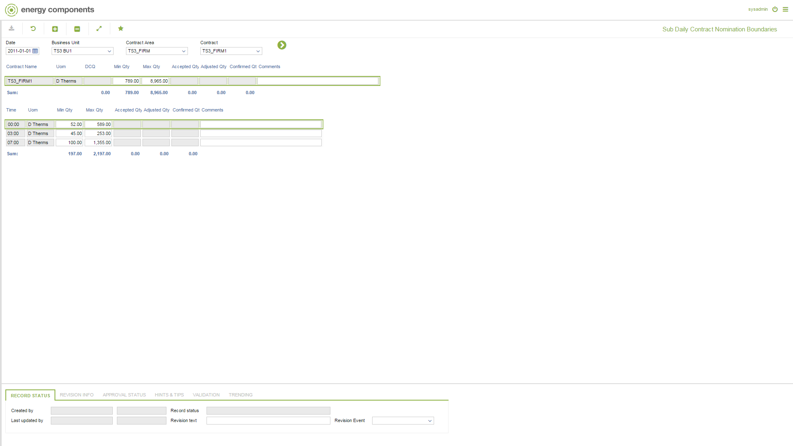

# GD.0093 - Sub Daily Contract Nomination Boundaries

_Deep-dive 2026-07-05 (deterministic runner). Module: GD._

## Identity
- BF_CODE: GD.0093 - URL: `/com.ec.tran.gd.screens/sub_daily_nom_boundaries/CLASS/TRCN_DAY_NOM_BOUND/CLASS_SUB/TRCN_SUB_DAY_NOM_BOUND`

## DB binding (metadata-resolved)
| Class | Type/Scope | Base table | View |
|---|---|---|---|
| `TRCN_SUB_DAY_NOM_BOUND` | DATA/1HR | `OBJ_TRAN_SUB_DAY_NOM_BOUND` | `DV_TRCN_SUB_DAY_NOM_BOUND` |

_Resolved by: url path token_

## Screen type
DATA/1HR

## Help (screen screenshot -- local online-help corpus 14.2.5)

## Help (field-description images -- local online-help corpus 14.2.5)
_(no field-description images in corpus for this BF_CODE)_
