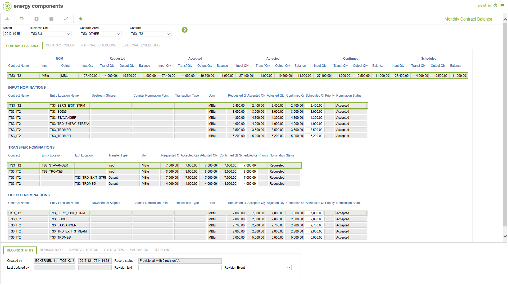
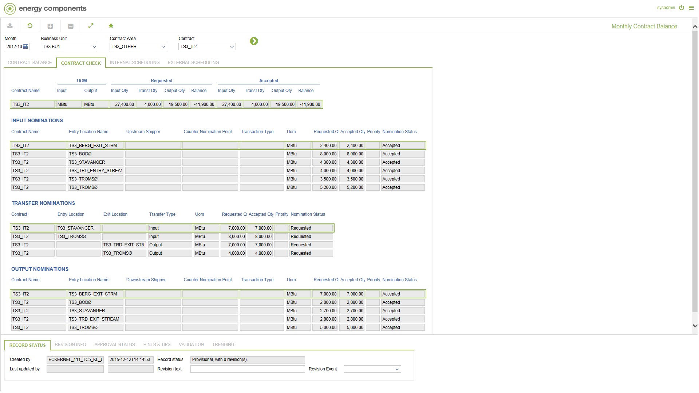
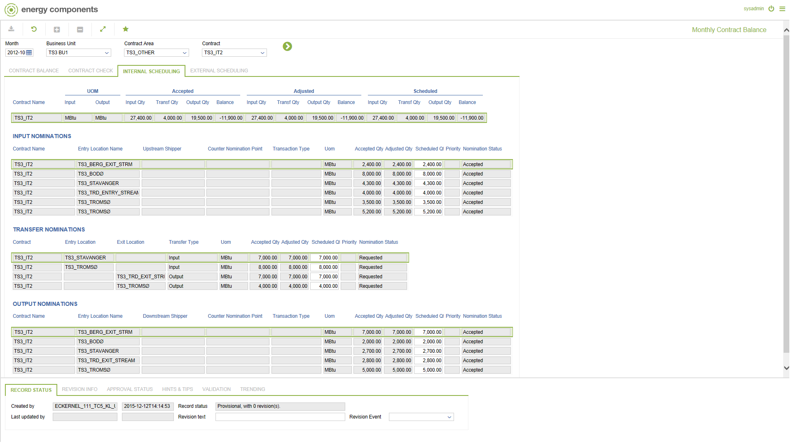
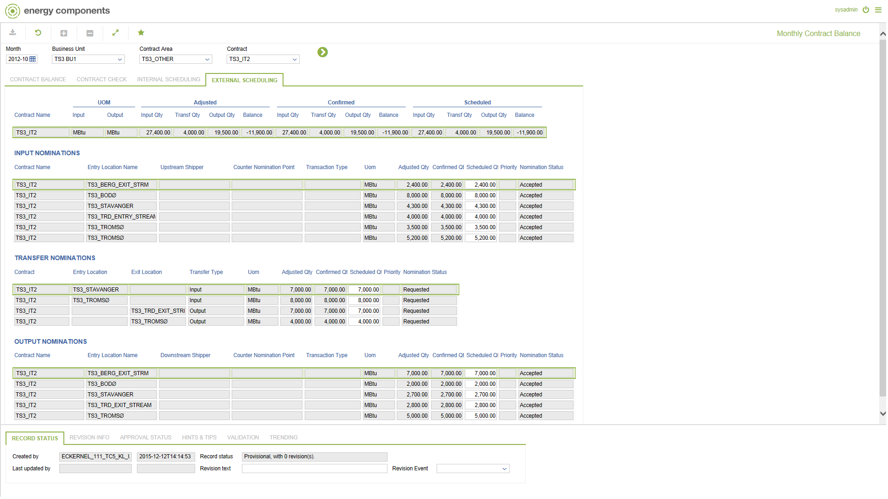

# GD.0110 - Monthly Contract Balance

_Deep-dive 2026-07-05 (deterministic runner). Module: GD._

## Identity
- BF_CODE: GD.0110 - URL: `/com.ec.tran.gd.screens/monthly_contract_balance/BF_PROFILE/GD.0110/NAV_MODEL/TRAN_COMMERCIAL/TARGET/CONTRACT/CLASS/TRCN_MTH_NOM_BAL/CLASS_2/TRNP_MTH_NOM_BAL_CNT_IN/CLASS_3/TRNP_MTH_NOM_TRANSF_BAL/CLASS_4/TRNP_MTH_NOM_BAL_CN_OUT/NOMINATION_CYCLE/false`

## DB binding (metadata-resolved)
| Class | Type/Scope | Base table | View |
|---|---|---|---|
| (no class resolved from URL/LABEL) | | | |

_Resolved by: not resolved_

## Screen type
process/config (no data class -- e.g. a process trigger, rule/formula editor or combination screen)

## Help (screen screenshot -- local online-help corpus 14.2.5)

## Help (field-description images -- local online-help corpus 14.2.5)
_(no field-description images in corpus for this BF_CODE)_
