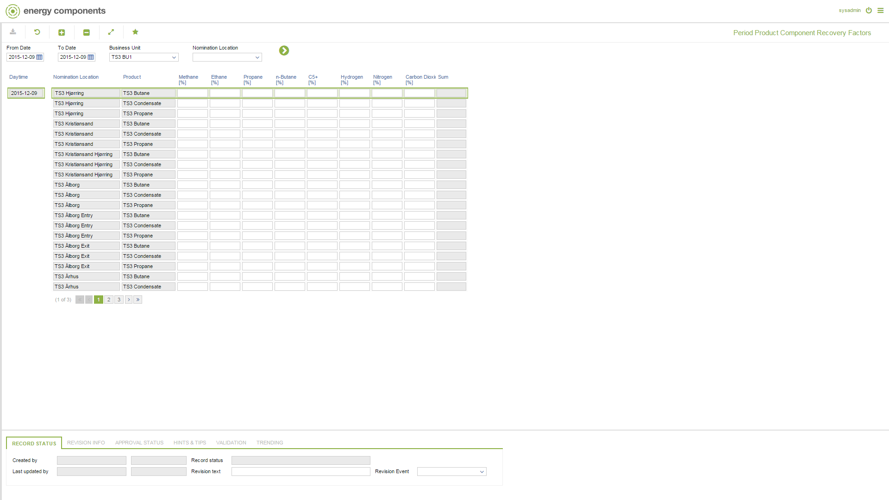

# GD.0111 - Period Product Component Recovery Factors

_Deep-dive 2026-07-05 (deterministic runner). Module: GD._

## Identity
- BF_CODE: GD.0111 - URL: `/com.ec.tran.gd.screens/product_component_recovery_factors/TARGET/NOMINATION_LOCATION/CLASS/TRNL_EVENT_PROD_CP_FAC/BF_PROFILE/GD.0111/CLASS_DAY/TRNL_EVENT_PROD_FAC_DAY/DIM1/PRODUCT_ID_POPUP`

## DB binding (metadata-resolved)
| Class | Type/Scope | Base table | View |
|---|---|---|---|
| `TRNL_EVENT_PROD_CP_FAC` | DATA/EVENT | `V_OBJ_EVENT_DIM1_CP_TRAN_FAC` | `DV_TRNL_EVENT_PROD_CP_FAC` |

_Resolved by: label (exact, unique)_

## Screen type
DATA/EVENT

## Help (screen screenshot -- local online-help corpus 14.2.5)

## Help (field-description images -- local online-help corpus 14.2.5)
_(no field-description images in corpus for this BF_CODE)_
