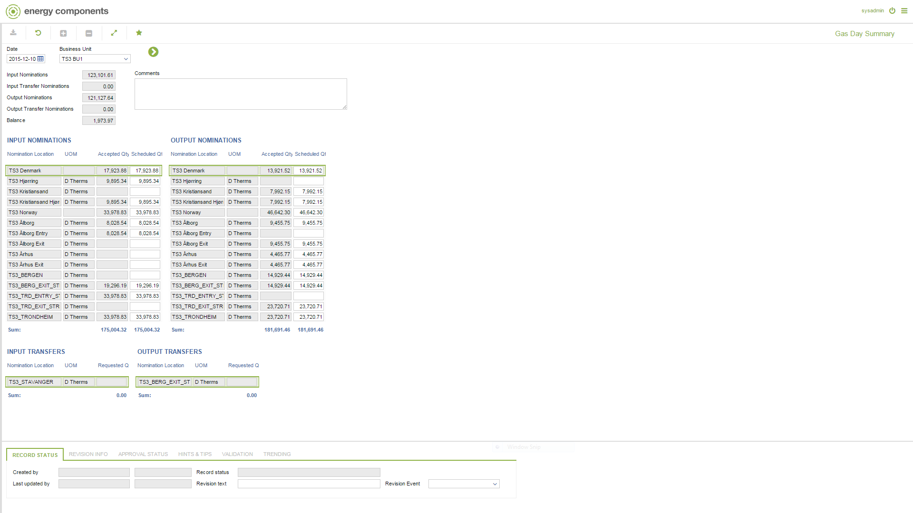

# GD.0115 - Gas Day Summary

_Deep-dive 2026-07-05 (deterministic runner). Module: GD._

## Identity
- BF_CODE: GD.0115 - URL: `/com.ec.tran.gd.screens/gas_day_summary/CLASS_SUM/TRBU_DAY_SUMMARY/CLASS_COM/TRBU_DAY_COMMENT/CLASS1/TRNL_DAY_NOM_IN_SUMMARY/CLASS2/TRNL_DAY_TRANSF_IN_SUM/CLASS3/TRNL_DAY_NOM_OUT_SUMMARY/CLASS4/TRNL_DAY_TRANSF_OUT_SUM`

## DB binding (metadata-resolved)
| Class | Type/Scope | Base table | View |
|---|---|---|---|
| `TRNL_DAY_TRANSF_OUT_SUM` | DATA/DAY | `v_nomloc_day_transfer_summary` | `DV_TRNL_DAY_TRANSF_OUT_SUM` |

_Resolved by: url path token_

## Screen type
N1 daily-status grid

## Help (screen screenshot -- local online-help corpus 14.2.5)

## Help (field-description images -- local online-help corpus 14.2.5)
_(no field-description images in corpus for this BF_CODE)_
