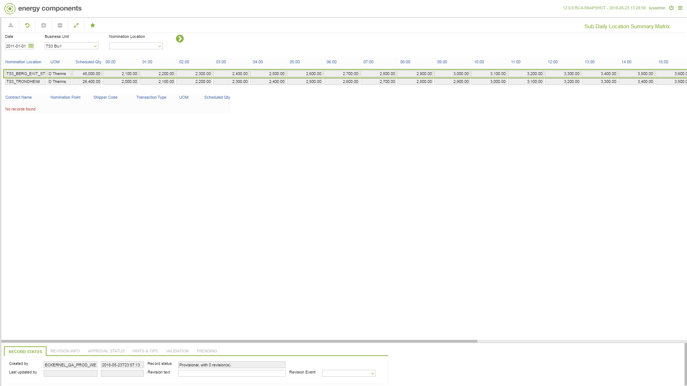

# GD.0116 - Sub Daily Location Summary Matrix

_Deep-dive 2026-07-05 (deterministic runner). Module: GD._

## Identity
- BF_CODE: GD.0116 - URL: `/com.ec.tran.gd.screens/sub_daily_location_summary_matrix/TARGET/NOMINATION_LOCATION/NAV_MODEL/TRAN_OPERATIONAL/BF_PROFILE/GD.0116/CLASS1/TRNL_SUB_DAY_NOM_MATRIX/CLASS2/TRNP_SUB_DAY_LOC_MATRIX/NOMINATION_CYCLE/FALSE`

## DB binding (metadata-resolved)
| Class | Type/Scope | Base table | View |
|---|---|---|---|
| `TRNL_SUB_DAY_NOM_MATRIX` | DATA/1HR | `OBJLOC_SUB_DAY_NOMINATION` | `DV_TRNL_SUB_DAY_NOM_MATRIX` |

_Resolved by: label (exact, unique)_

## Screen type
DATA/1HR

## Help (screen screenshot -- local online-help corpus 14.2.5)

## Help (field-description images -- local online-help corpus 14.2.5)
_(no field-description images in corpus for this BF_CODE)_
