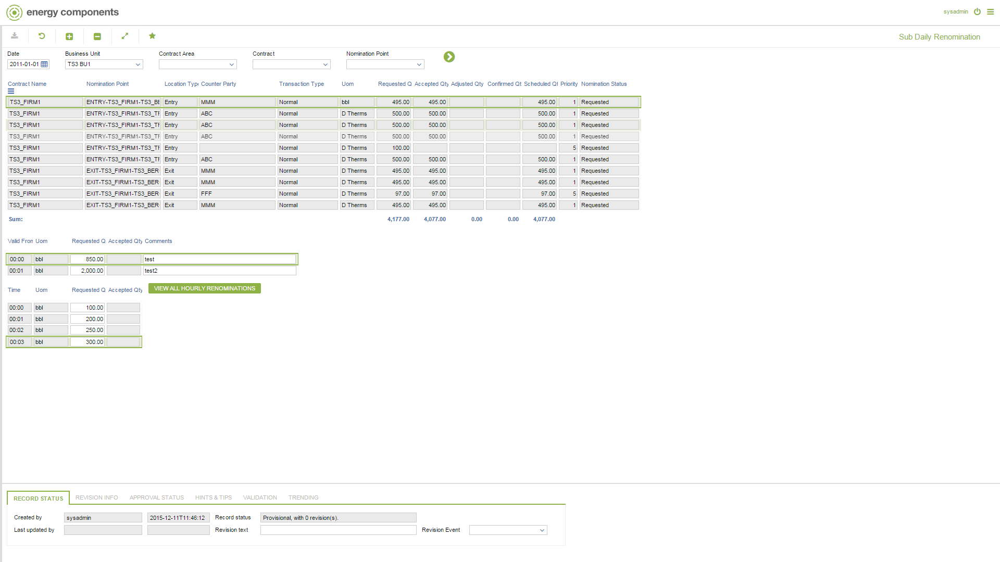

# GD.0120 - Sub Daily Renomination

_Deep-dive 2026-07-05 (deterministic runner). Module: GD._

## Identity
- BF_CODE: GD.0120 - URL: `/com.ec.tran.gd.screens/sub_daily_renomination/NOM_CLASS/TRNP_DAY_RENOM_LIST/RENOM_CLASS/TRNP_DAY_RENOMINATION/RENOM_SUB_CLASS/TRNP_SUB_DAY_RENOM/TARGET/NOMINATION_POINT`

## DB binding (metadata-resolved)
| Class | Type/Scope | Base table | View |
|---|---|---|---|
| `NOMINATION_POINT` | OBJECT/VERSIONED | `NOMINATION_POINT` | `OV_NOMINATION_POINT` |

_Resolved by: url path token_

## Screen type
OV (master-data object)

## Help (screen screenshot -- local online-help corpus 14.2.5)

## Help (field-description images -- local online-help corpus 14.2.5)
_(no field-description images in corpus for this BF_CODE)_
