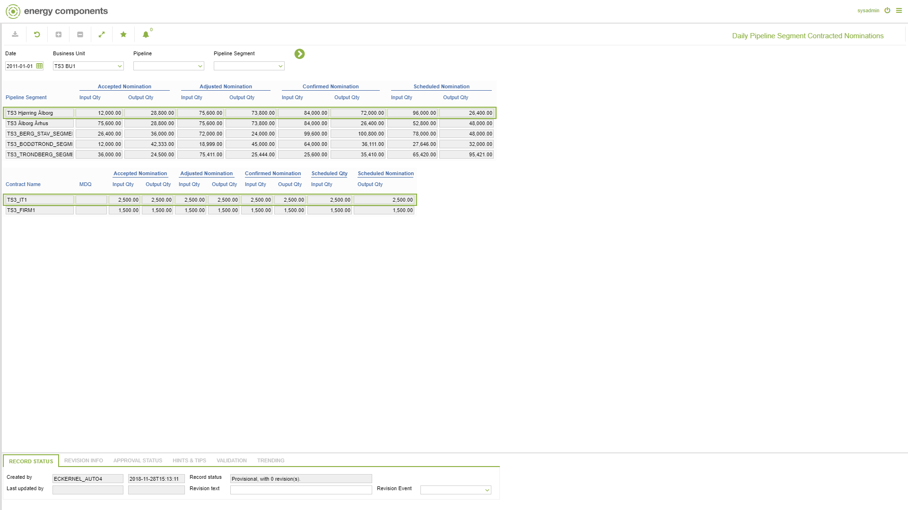

# GD.0155 - Daily Pipeline Segment Contracted Nominations

_Deep-dive 2026-07-05 (deterministic runner). Module: GD._

## Identity
- BF_CODE: GD.0155 - URL: `/com.ec.tran.gd.screens/daily_pipeline_segment_contracted_nominations/TARGET/PIPELINE_SEGMENT/NAV_MODEL/TRAN_OPERATIONAL/BF_PROFILE/GD.0155/CLASS1/TRPS_DAY_NOMINATION/CLASS2/TRPS_DAY_CNTR_NOM`

## DB binding (metadata-resolved)
| Class | Type/Scope | Base table | View |
|---|---|---|---|
| `TRPS_DAY_CNTR_NOM` | DATA/DAY | `OBJLOC_DAY_CNTR_NOM` | `DV_TRPS_DAY_CNTR_NOM` |

_Resolved by: url path token_

## Screen type
N1 daily-status grid

## Help (screen screenshot -- local online-help corpus 14.2.5)

## Help (field-description images -- local online-help corpus 14.2.5)
_(no field-description images in corpus for this BF_CODE)_
