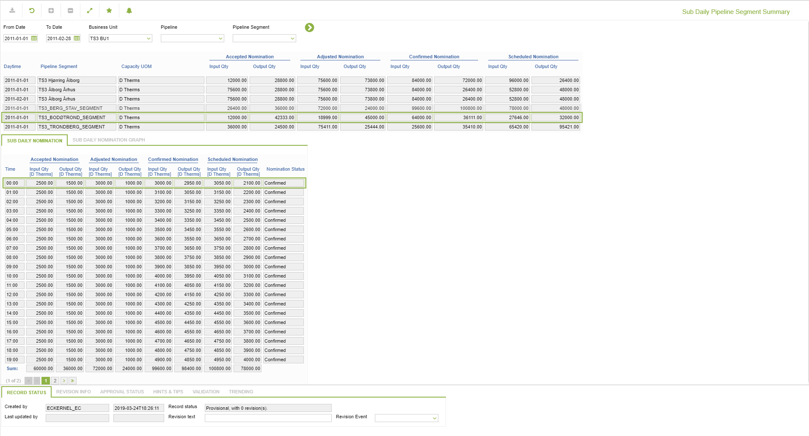
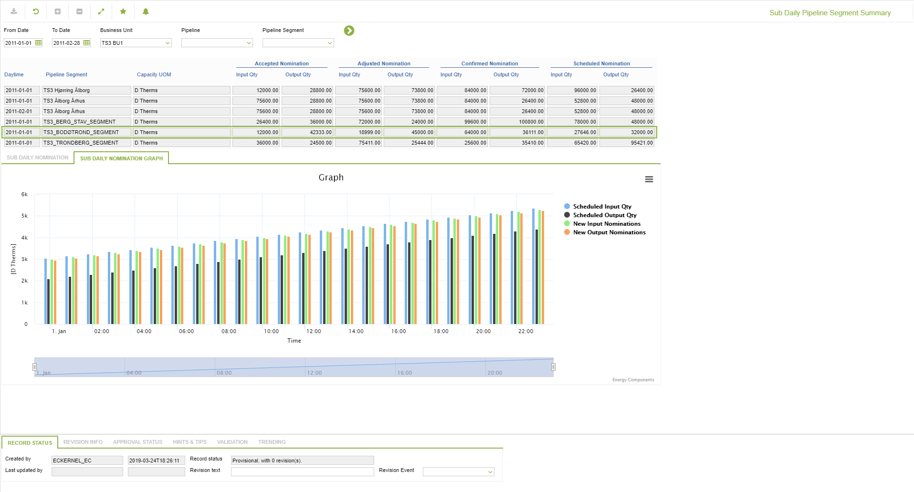

# GD.0160 - Sub Daily Pipeline Segment Summary

_Deep-dive 2026-07-05 (deterministic runner). Module: GD._

## Identity
- BF_CODE: GD.0160 - URL: `/com.ec.tran.gd.screens/sub_daily_pipeline_segment_summary/TARGET/PIPELINE_SEGMENT/NAV_MODEL/TRAN_OPERATIONAL/BF_PROFILE/GD.0160/CLASS/TRPS_DAY_NOMINATION/SUB_CLASS/TRPS_SUB_DAY_NOM/GRAPH_CLASS/TRPS_SUB_DAY_NOM_GRAPH`

## DB binding (metadata-resolved)
| Class | Type/Scope | Base table | View |
|---|---|---|---|
| `TRPS_SUB_DAY_NOM_GRAPH` | DATA/1HR | `OBJLOC_SUB_DAY_NOMINATION` | `DV_TRPS_SUB_DAY_NOM_GRAPH` |

_Resolved by: url path token_

## Screen type
DATA/1HR

## Help (screen screenshot -- local online-help corpus 14.2.5)

## Help (field-description images -- local online-help corpus 14.2.5)
_(no field-description images in corpus for this BF_CODE)_
