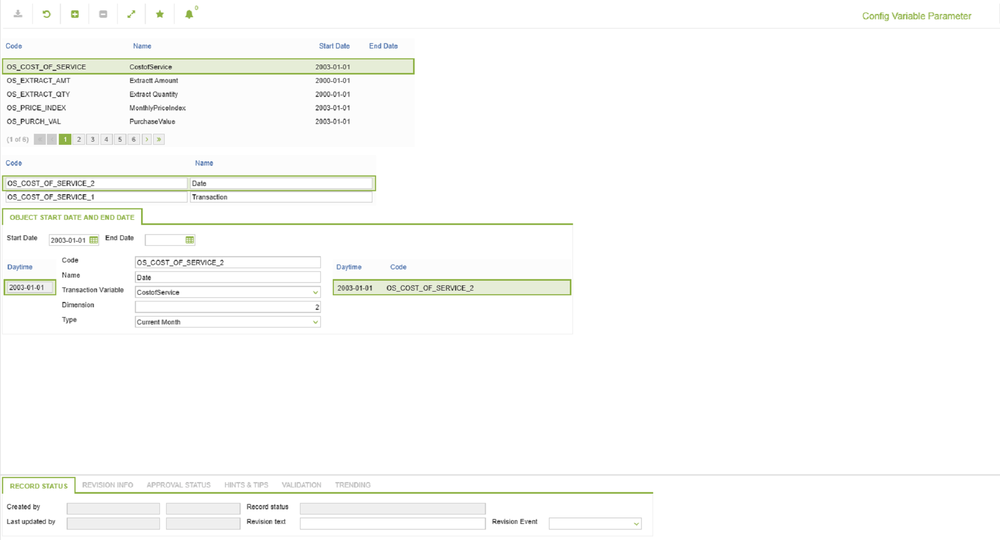

# IN.0032 - Config Variable Parameter

_Deep-dive 2026-07-06 (deterministic runner). Module: IN._

## Identity
- BF_CODE: IN.0032 - URL: `/com.ec.frmw.co.screens/manage_object_relation/CLASS_NAME/CONFIG_VARIABLE_PARAM/FROM_CLASS_NAME/CONFIG_VARIABLE/ROLE_ID/CONFIG_VARIABLE_ID`

## DB binding (metadata-resolved)
| Class | Type/Scope | Base table | View |
|---|---|---|---|
| `CONFIG_VARIABLE_PARAM` | OBJECT/VERSIONED | `CONFIG_VARIABLE_PARAM` | `OV_CONFIG_VARIABLE_PARAM` |
| `CONFIG_VARIABLE` | OBJECT/VERSIONED | `CONFIG_VARIABLE` | `OV_CONFIG_VARIABLE` |

_Resolved by: url CLASS_NAME_

## Screen type
OV (master-data object)

## Help (screen screenshot -- local online-help corpus 14.2.5)

## Help (field-description images -- local online-help corpus 14.2.5)
_(no field-description images in corpus for this BF_CODE)_
