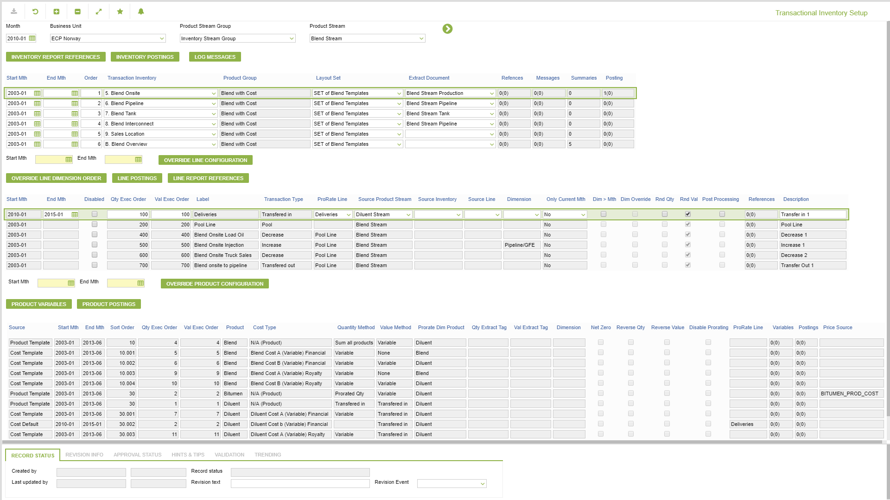
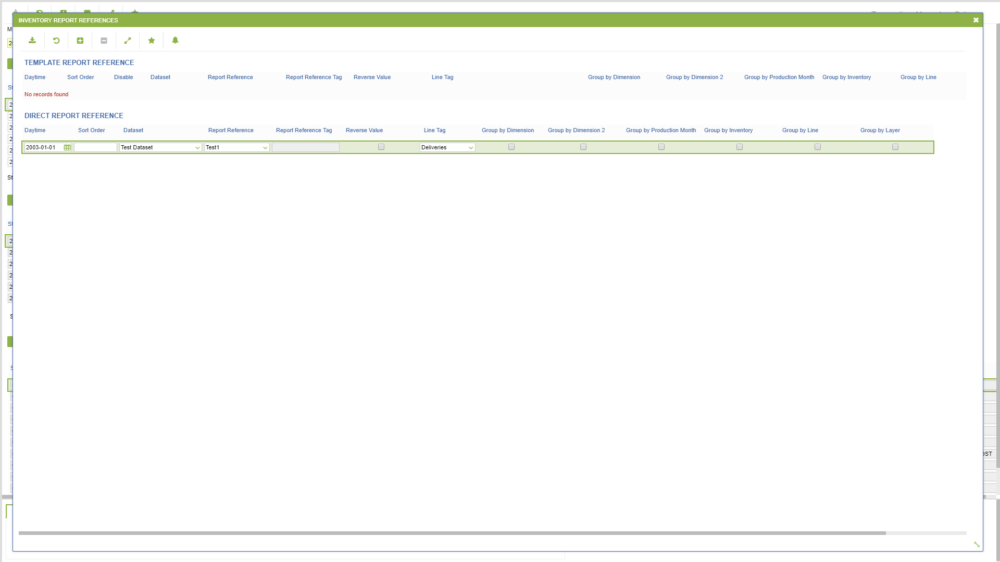
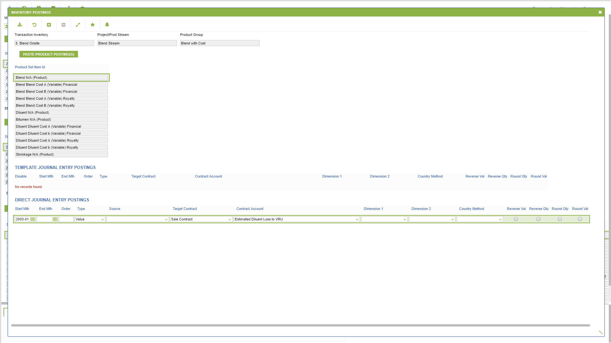
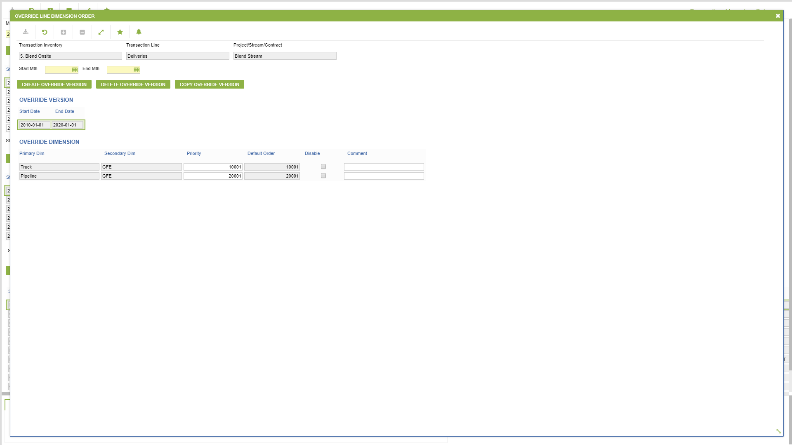
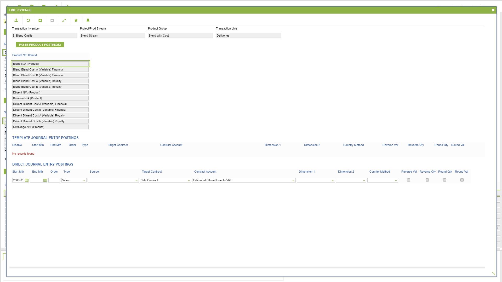
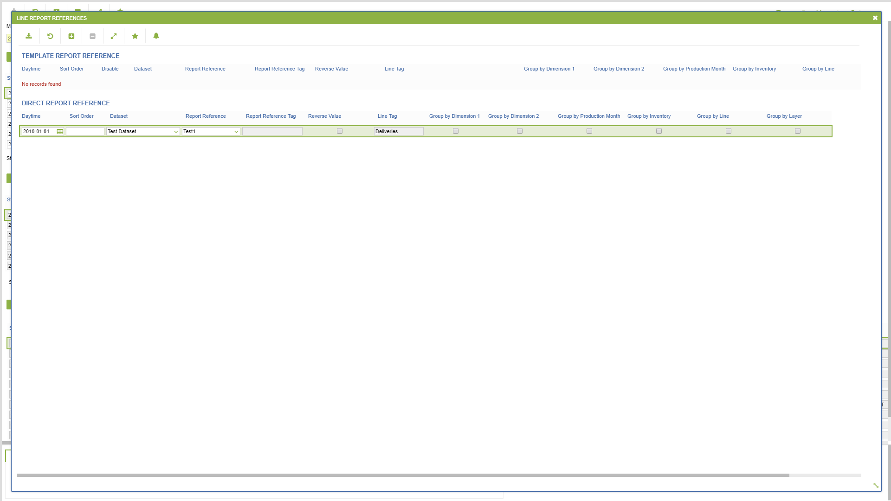
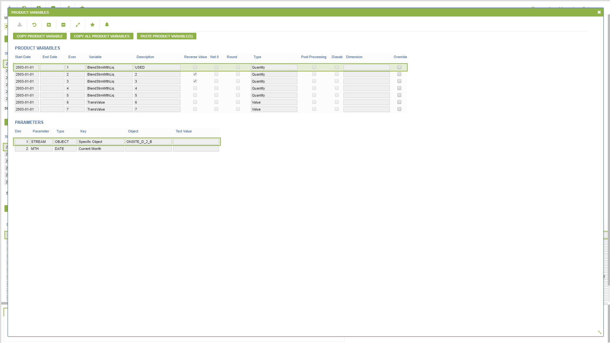
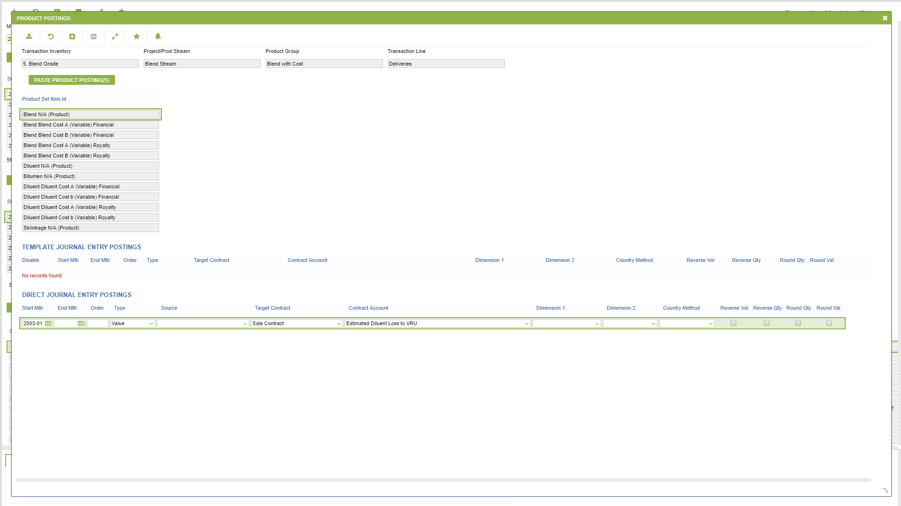

# IN.0036 - Transactional Inventory Setup

_Deep-dive 2026-07-06 (deterministic runner). Module: IN._

## Identity
- BF_CODE: IN.0036 - URL: `/com.ec.revn.in/trans_inv_prod_stream/OBJ_CLASS/REVN_PROD_STREAM/DATA_CLASS/TRANS_INV_PROD_STREAM`

## DB binding (metadata-resolved)
| Class | Type/Scope | Base table | View |
|---|---|---|---|
| `TRANS_INV_PROD_STREAM` | DATA/MTH | `TRANS_INV_PROD_STREAM` | `DV_TRANS_INV_PROD_STREAM` |

_Resolved by: url path token_

## Screen type
DATA/MTH

## Help (screen screenshot -- local online-help corpus 14.2.5)

## Help (field-description images -- local online-help corpus 14.2.5)
_(no field-description images in corpus for this BF_CODE)_
