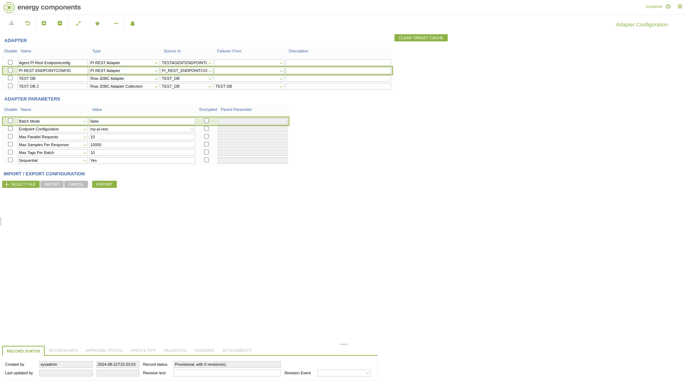

# IS.0010 - Adapter Configuration

_Deep-dive 2026-07-07 (deterministic runner). Module: IS._

## Identity
- BF_CODE: IS.0010 - URL: `/com.ec.ecdm.co.screens/adapter_config`

## DB binding (metadata-resolved)
| Class | Type/Scope | Base table | View |
|---|---|---|---|
| `ECIS_ADAPTER` | TABLE/EVENT | `ECIS_ADAPTER` | `TV_ECIS_ADAPTER` |

_Resolved by: label (exact, unique)_

## Screen type
TV (table-class)

## Help (screen screenshot -- local online-help corpus 14.2.5)

## Help (field-description images -- local online-help corpus 14.2.5)
_(no field-description images in corpus for this BF_CODE)_
