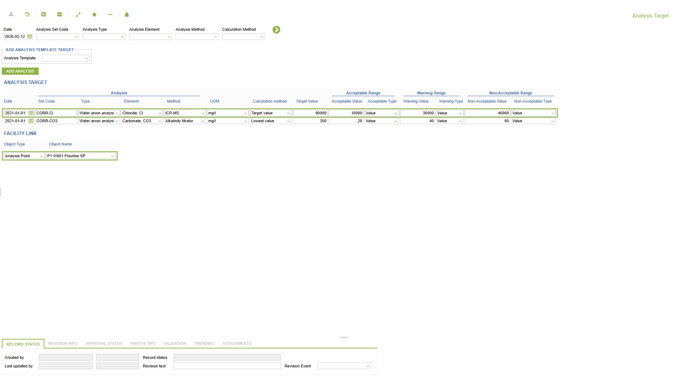

# LM.0005 - Analysis Target

_Deep-dive 2026-07-07 (deterministic runner). Module: LM._

## Identity
- BF_CODE: LM.0005 - URL: `/com.ec.chem.lm.screens/analysis_target`

## DB binding (metadata-resolved)
| Class | Type/Scope | Base table | View |
|---|---|---|---|
| `ANALYSIS_TARGET` | TABLE/NONE | `ANALYSIS_TARGET` | `TV_ANALYSIS_TARGET` |

_Resolved by: url path token_

## Screen type
TV (table-class)

## Help (screen screenshot -- local online-help corpus 14.2.5)

## Help (field-description images -- local online-help corpus 14.2.5)
_(no field-description images in corpus for this BF_CODE)_
