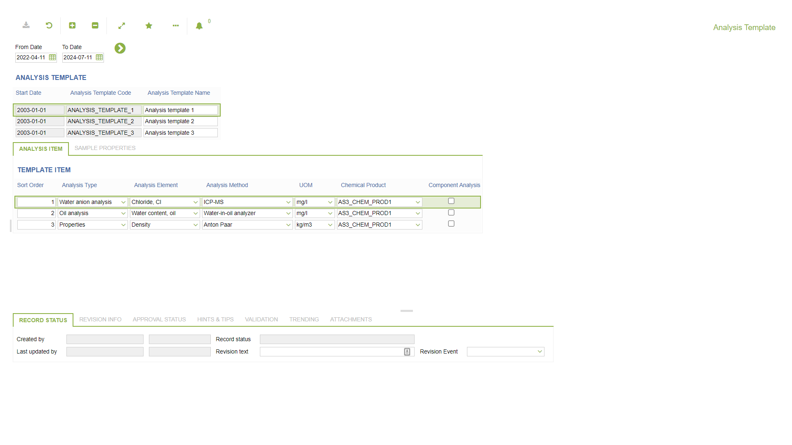
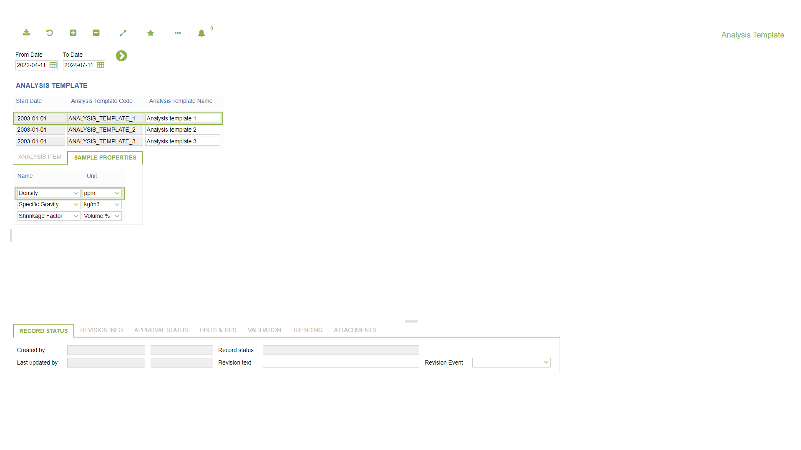

# LM.0006 - Analysis Template

_Deep-dive 2026-07-07 (deterministic runner). Module: LM._

## Identity
- BF_CODE: LM.0006 - URL: `/com.ec.chem.lm.screens/chem_analysis_template/CLASS_NAME/ANALYSIS_TEMPLATE/LIST_ITEM_CLASS/ANALYSIS_TEMPLATE_ITEM`

## DB binding (metadata-resolved)
| Class | Type/Scope | Base table | View |
|---|---|---|---|
| `ANALYSIS_TEMPLATE` | TABLE/EVENT | `ANALYSIS_TEMPLATE` | `TV_ANALYSIS_TEMPLATE` |

_Resolved by: url CLASS_NAME_

## Screen type
TV (table-class)

## Help (screen screenshot -- local online-help corpus 14.2.5)

## Help (field-description images -- local online-help corpus 14.2.5)
_(no field-description images in corpus for this BF_CODE)_
