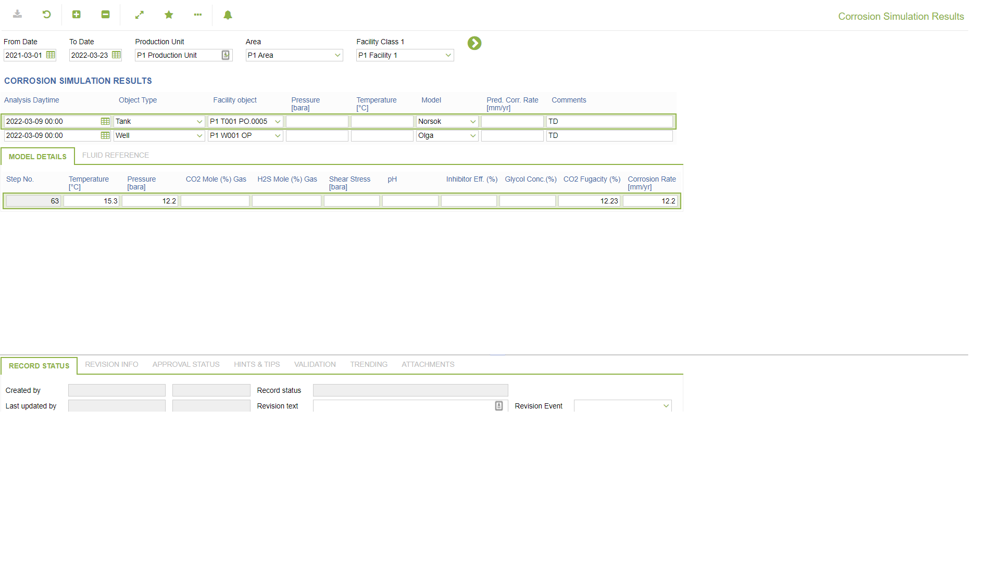
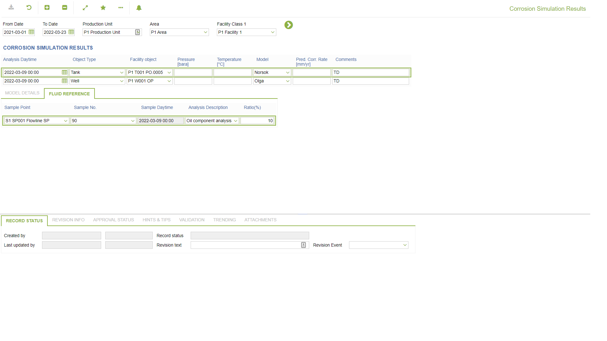

# LM.0013 - Corrosion Simulation Results

_Deep-dive 2026-07-07 (deterministic runner). Module: LM._

## Identity
- BF_CODE: LM.0013 - URL: `/com.ec.chem.lm.screens/lab_corr_simulation`

## DB binding (metadata-resolved)
| Class | Type/Scope | Base table | View |
|---|---|---|---|
| `LAB_CORROSION_SIMULATION` | TABLE/NONE | `LAB_CORROSION_SIMULATION` | `TV_LAB_CORROSION_SIMULATION` |

_Resolved by: label (exact, unique)_

## Screen type
TV (table-class)

## Help (screen screenshot -- local online-help corpus 14.2.5)

## Help (field-description images -- local online-help corpus 14.2.5)
_(no field-description images in corpus for this BF_CODE)_
