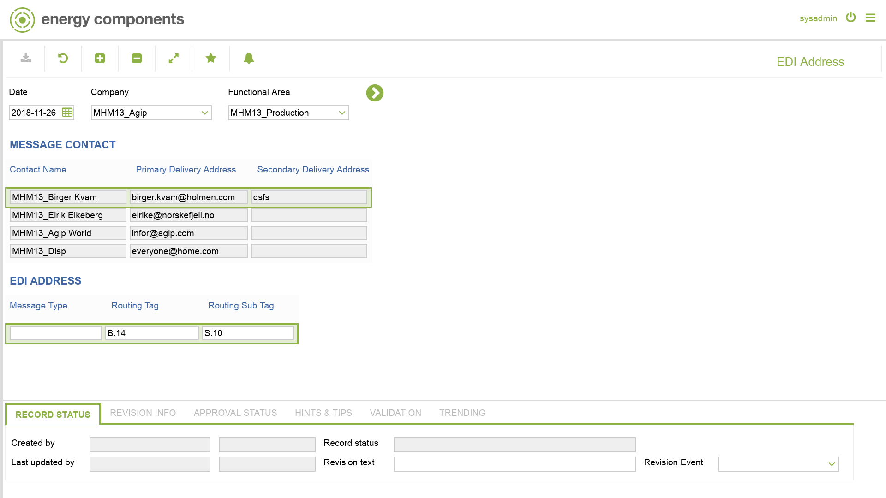

# MHM.0002 - EDI Address

_Deep-dive 2026-07-06 (deterministic runner). Module: MHM._

## Identity
- BF_CODE: MHM.0002 - URL: `/com.ec.frmw.mhm.screens/edi_address`

## DB binding (metadata-resolved)
| Class | Type/Scope | Base table | View |
|---|---|---|---|
| `EDI_ADDRESS` | DATA/NONE | `COMPANY_CONTACT_EDI` | `DV_EDI_ADDRESS` |

_Resolved by: url path token_

## Screen type
DATA/NONE

## Help (screen screenshot -- local online-help corpus 14.2.5)

## Help (field-description images -- local online-help corpus 14.2.5)
_(no field-description images in corpus for this BF_CODE)_
