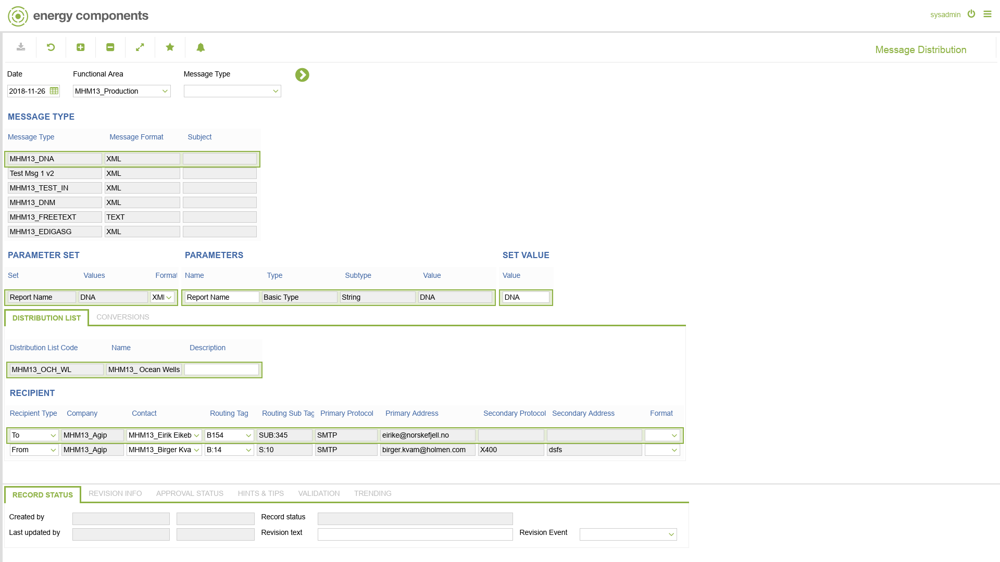
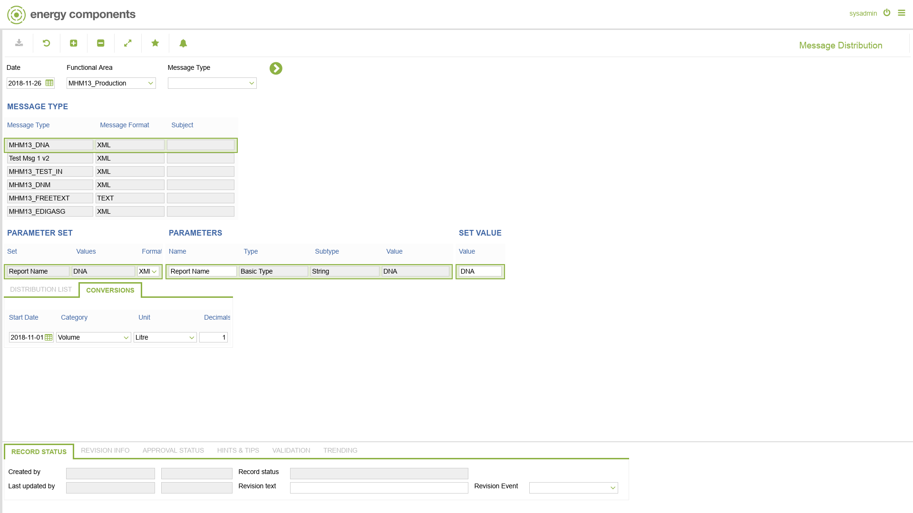

# MHM.0004 - Message Distribution

_Deep-dive 2026-07-06 (deterministic runner). Module: MHM._

## Identity
- BF_CODE: MHM.0004 - URL: `/com.ec.frmw.mhm.screens/message_distribution`

## DB binding (metadata-resolved)
| Class | Type/Scope | Base table | View |
|---|---|---|---|
| `MESSAGE_DISTRIBUTION` | DATA/NONE | `MESSAGE_DISTRIBUTION` | `DV_MESSAGE_DISTRIBUTION` |

_Resolved by: url path token_

## Screen type
DATA/NONE

## Help (screen screenshot -- local online-help corpus 14.2.5)

## Help (field-description images -- local online-help corpus 14.2.5)
_(no field-description images in corpus for this BF_CODE)_
