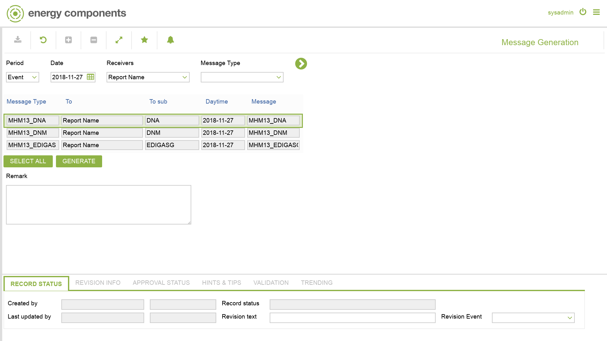

# MHM.0013 - Message Generation

_Deep-dive 2026-07-06 (deterministic runner). Module: MHM._

## Identity
- BF_CODE: MHM.0013 - URL: `/com.ec.frmw.mhm.screens/message_generation`

## DB binding (metadata-resolved)
| Class | Type/Scope | Base table | View |
|---|---|---|---|
| `MESSAGE_GENERATION` | TABLE/NONE | `V_MSG_GENERATION` | `TV_MESSAGE_GENERATION` |

_Resolved by: url path token_

## Screen type
TV (table-class)

## Help (screen screenshot -- local online-help corpus 14.2.5)

## Help (field-description images -- local online-help corpus 14.2.5)
_(no field-description images in corpus for this BF_CODE)_
