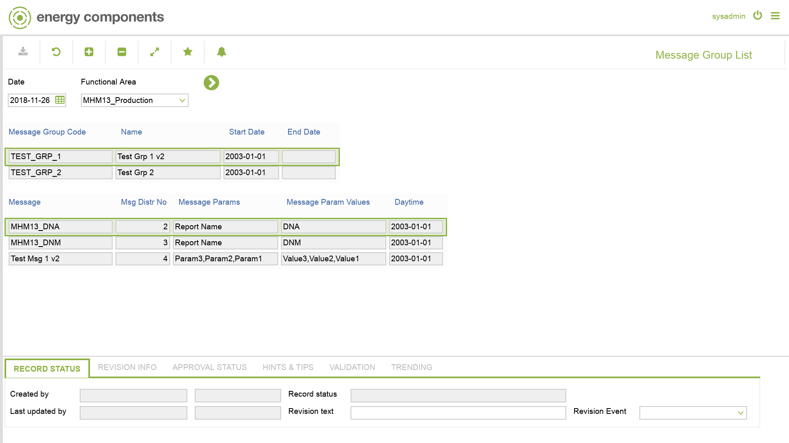

# MHM.0014 - Message Group List

_Deep-dive 2026-07-06 (deterministic runner). Module: MHM._

## Identity
- BF_CODE: MHM.0014 - URL: `/com.ec.frmw.mhm.screens/message_group`

## DB binding (metadata-resolved)
| Class | Type/Scope | Base table | View |
|---|---|---|---|
| `MESSAGE_GROUP` | OBJECT/VERSIONED | `MESSAGE_GROUP` | `OV_MESSAGE_GROUP` |

_Resolved by: url path token_

## Screen type
OV (master-data object)

## Help (screen screenshot -- local online-help corpus 14.2.5)

## Help (field-description images -- local online-help corpus 14.2.5)
_(no field-description images in corpus for this BF_CODE)_
