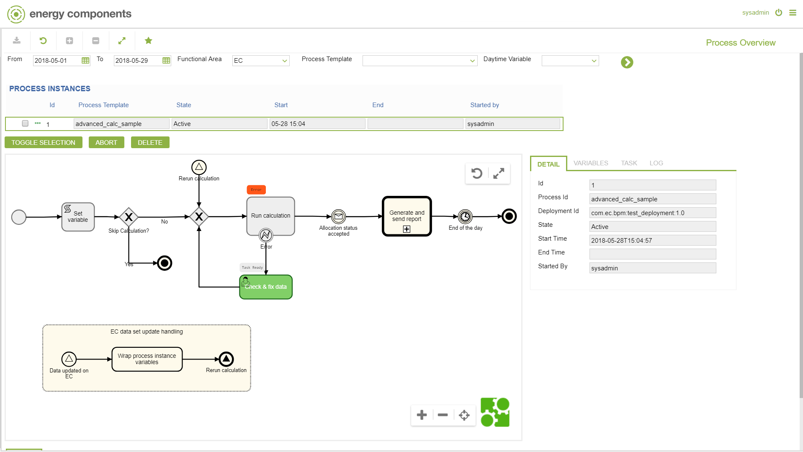
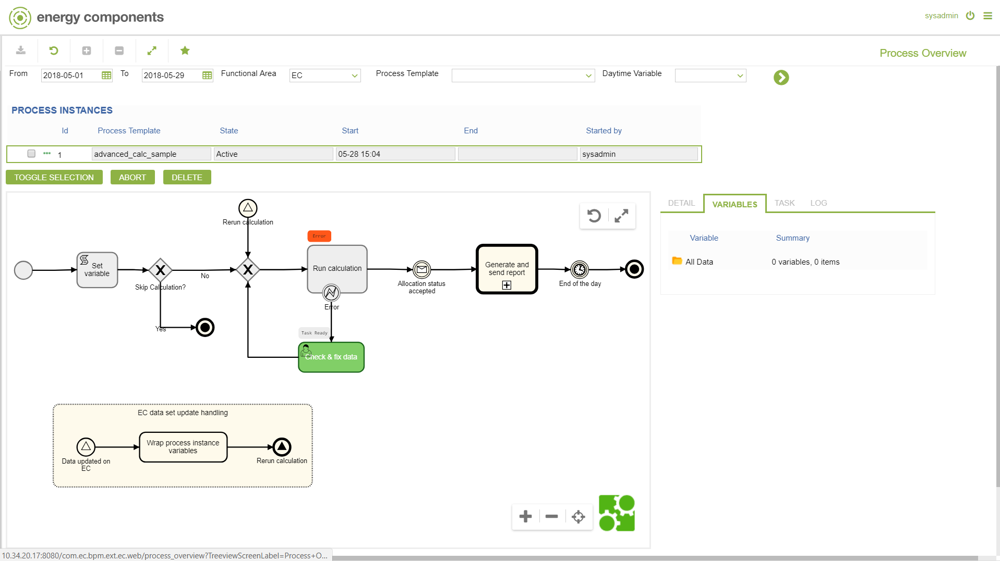
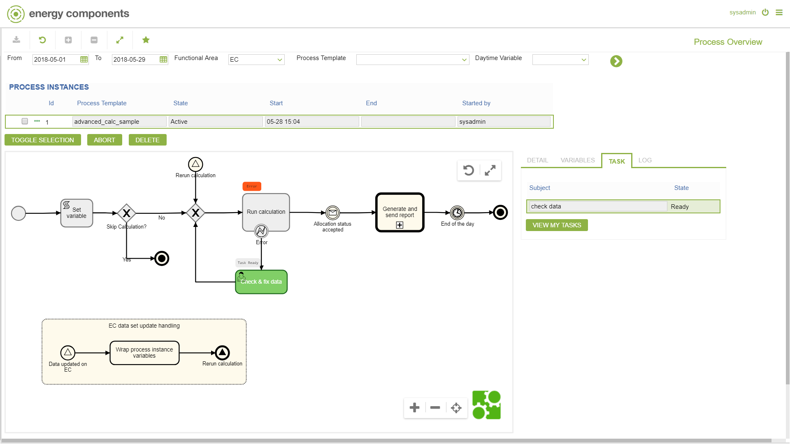
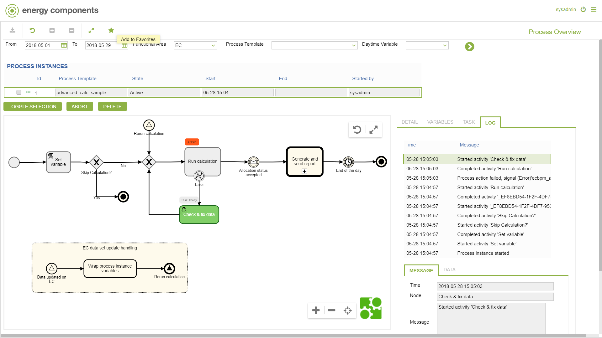

# PA.0004 - Process Overview

_Deep-dive 2026-07-06 (deterministic runner). Module: PA._

## Identity
- BF_CODE: PA.0004 - URL: `/com.ec.bpm.ext.ec.web/process_overview`

## DB binding (metadata-resolved)
| Class | Type/Scope | Base table | View |
|---|---|---|---|
| (no class resolved from URL/LABEL) | | | |

_Resolved by: not resolved_

## Screen type
process/config (no data class -- e.g. a process trigger, rule/formula editor or combination screen)

## Help (screen screenshot -- local online-help corpus 14.2.5)

## Help (field-description images -- local online-help corpus 14.2.5)
_(no field-description images in corpus for this BF_CODE)_
