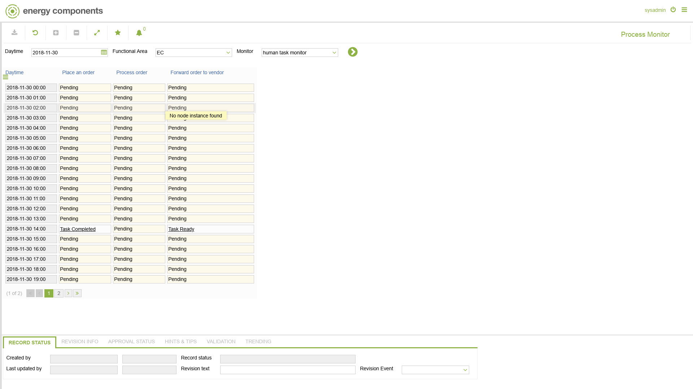

# PA.0009 - Process Monitor

_Deep-dive 2026-07-06 (deterministic runner). Module: PA._

## Identity
- BF_CODE: PA.0009 - URL: `/com.ec.bpm.ext.ec.web/process_monitor_viewer`

## DB binding (metadata-resolved)
| Class | Type/Scope | Base table | View |
|---|---|---|---|
| `PROCESS_MONITOR` | TABLE/EVENT | `PROCESS_MONITOR` | `TV_PROCESS_MONITOR` |

_Resolved by: label (exact, unique)_

## Screen type
TV (table-class)

## Help (screen screenshot -- local online-help corpus 14.2.5)

## Help (field-description images -- local online-help corpus 14.2.5)
_(no field-description images in corpus for this BF_CODE)_
