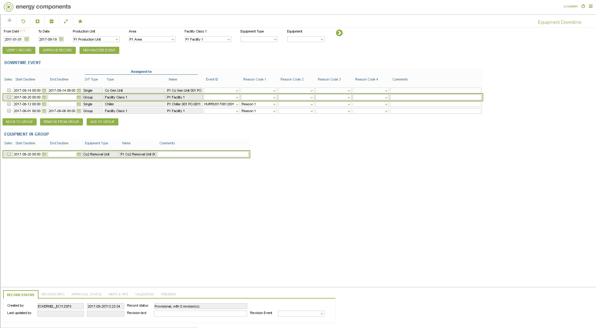

# PD.0022 - Equipment Downtime

_Deep-dive 2026-07-06 (deterministic runner). Module: PD._

## Identity
- BF_CODE: PD.0022 - URL: `/com.ec.prod.pd.screens/equip_downtime`

## DB binding (metadata-resolved)
| Class | Type/Scope | Base table | View |
|---|---|---|---|
| `EQUIP_DOWNTIME` | DATA/EVENT | `EQUIP_DOWNTIME` | `DV_EQUIP_DOWNTIME` |

_Resolved by: url path token_

## Screen type
DATA/EVENT

## Help (screen screenshot -- local online-help corpus 14.2.5)

## Help (field-description images -- local online-help corpus 14.2.5)
_(no field-description images in corpus for this BF_CODE)_
