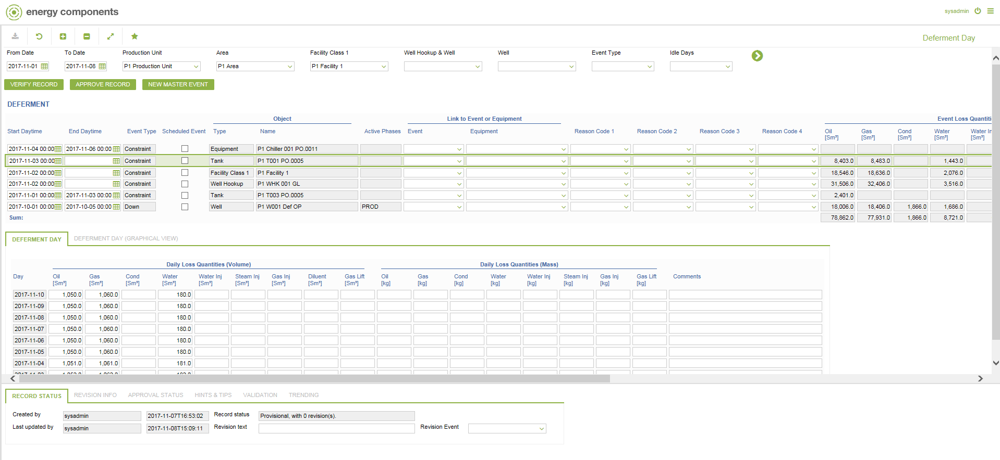

# PD.0023 - Deferment Day

_Deep-dive 2026-07-06 (deterministic runner). Module: PD._

## Identity
- BF_CODE: PD.0023 - URL: `/com.ec.prod.pd.screens/deferment_day/CLASS_NAME/DEFERMENT_EVENT/DAILY_CLASS_NAME/DEFERMENT_DAY/TABLE_NAME/DEFERMENT_EVENT/STREAM_SET/PD.0023`

## DB binding (metadata-resolved)
| Class | Type/Scope | Base table | View |
|---|---|---|---|
| `DEFERMENT_EVENT` | TABLE/EVENT | `DEFERMENT_EVENT` | `TV_DEFERMENT_EVENT` |
| `DEFERMENT_DAY` | TABLE/EVENT | `DEFERMENT_DAY` | `TV_DEFERMENT_DAY` |

_Resolved by: url CLASS_NAME_

## Screen type
TV (table-class)

## Help (screen screenshot -- local online-help corpus 14.2.5)

## Help (field-description images -- local online-help corpus 14.2.5)
_(no field-description images in corpus for this BF_CODE)_
